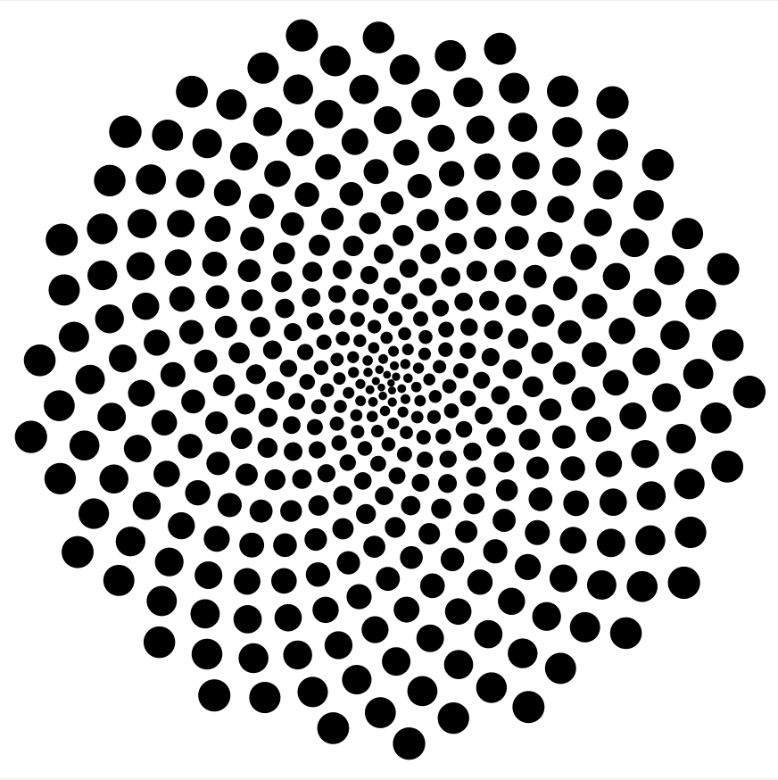

Algorithm
===============================
This repository contains implementations of various known algorithms from selected fields of algorithm desing in computer science. The README files are written as a basic tool that can be used to quickly understand what kind of algorithms that is implemented.  

Some test files use the [Python Matplotlib Wrapper](https://github.com/lava/matplotlib-cpp).

