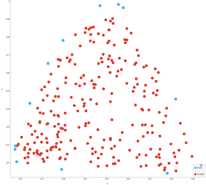

Algo
===============================
This repository contains implementations of various known algorithms from selected fields of algorithm design in computer science, 
mathematics, data mining and etc. A not so unrealistic goal is to have the source code 100% unit tested and a 100% code coverage. 


# Constraints

The algorithms are implemented **only** using the C++ standard library.

The examples in `examples/` may use additional libraries but should not be required when building the library itself.

# Resources

### Data
For generating and plotting data, the [Orange](https://orange.biolab.si) data mining tool is used. It's super easy to 
output a data set in csv format to play with. The result of the C++ algorithms may then be plotted with the 
same tool. Not a single line of code.

### Unit tests
The C++ code is tested with the [Google Test](https://github.com/google/googletest) framework.

# A brief overview

## Data mining
Some people may categorize these algorithms as machine learning.

### K-Means Clustering

```C++
Clusters KMeans(geometry::Points points, const std::int8_t& k);
```
Outputs `k` clusters. The input 2D-points in `points` will be clustered based on the nearest cluster centroid, using the Euclidean distance.


 


### K-nearest neighbors

```C++
LabeledPoints KNearestNeighbor(const geometry::Points& unlabeled_data, LabeledPoints& labeled_data, const std::uint8_t& k);
```

Labels the points in `unlabeled_data` based on the `k` nearest neighbors in `labeled_data`. First image shows data with four labels and produces four clusters using `k = 5`.
The second image outputs two clusters (there are two labels) and `k=5`.

 

## Computational geometry

### Convex hull

The convex hull is the minimal polygon than contains all the input points. It's like a rubber band around the points.
This implementation is based on the quickhull algorithm.

[Quickhull, Wikipedia.](https://en.wikipedia.org/wiki/Quickhull)

```C++
Points ConvexHull(Points points);
```

Returns the convex hull of `points`, the convex hull is in the returned `Points`.

 
