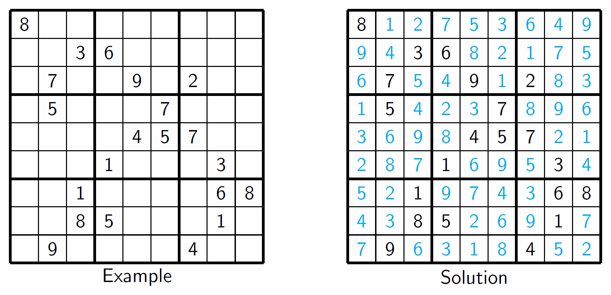

Backtracking Algorithms
=====================================

### Sudoku
Solves a Sudoku Puzzle very fast. The file `files/sudoku/worlds_hardest.txt`, is the Wordl's hardest Sudoku puzzle according to [The Telegraph](http://www.telegraph.co.uk/news/science/science-news/9359579/Worlds-hardest-sudoku-can-you-crack-it.html), and the backtracking sudoku solves it in ~0.004 s. The example and solution is shown below.

