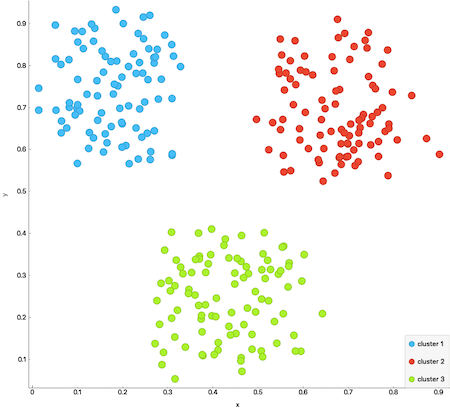
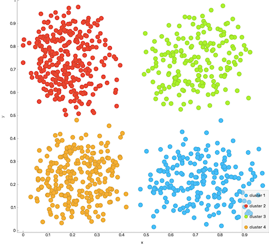

Data mining algorithms
======================

## K-means clustering

The K-means algorithm clusters the input points in to K clusters. K has to be chose with some wisdom. 
Before choosing K, the data should be observed, preferably in a scatter plot. In that plot it's
often possible to understand how many clusters (K) it contains. In image one and two K has been set to 
3 and 4 respectively.

[K-means clustering, Wikipedia.](https://en.wikipedia.org/wiki/K-means_clustering)

### Usage

* The function returns K clusters, where each cluster contains a set of points.
* K can not be greater than the number of input points.
* K can be 1 but it's rather useless.
* If K is zero, or if the input is empty, or if K > the size of the input, an empty Clusters will be returned.


#### Example usage
```C++
#include "data_mining_algorithms.hpp"

using namespace algo::data_mining;

...

Points points{{0.212603, 0.553522},
            {0.194965, 0.527275},
            {0.219101, 0.52271},
            {0.220029, 0.527275},
            {0.206105, 0.529557},
            {0.206105, 0.51358},
            {0.207961, 0.512439},
            {0.220029, 0.524992},
            {0.211675, 0.536404}};

Clusters clusters{KMeans(points, 3)};
```

### Example
`examples/data_mining/kmeans_example.cpp`

 