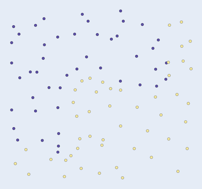
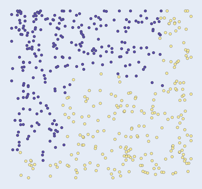

Data mining algorithms
===============

# Clustering algorithms

## K-Means Clustering

```cpp
std::vector<Point> points{{1.1, 1.0}, {1.2, 1.1}, ...};
Cluster cluster{points};
size_t nbr_clusters{2};
auto clusters = cluster.KMeans(norms::Euclidean(), nbr_clusters);
```
Returns a list of integers that indicates which cluster each point belongs to. 
A cluster index may be found at the same position in `points` and `clusters`.

KMeans can handle N dimensions.

### Examples
 

## DBSCAN
>Density-based spatial clustering of applications with noise (DBSCAN) is a data clustering algorithm [...]. It is a
>density-based clustering non-parametric algorithm: given a set of points in some space, it groups together points
>that are closely packed together (points with many nearby neighbors), marking as outliers points that lie alone in
>low-density regions.

```cpp
std::vector<Point> points{{0.0428843, 0.967891}, {0.0418432, 0.943829}, ...;

// Min distance to neighbour points  
double epsiolon{0.2};
// Min number of points in a cluster
size_t min_points_in_cluster{3};

Cluster cluster{points};
auto clusters = cluster.DbScan(norms::Euclidean(), epsilon, min_points_in_cluster);
```
Returns a list of integers that indicates which cluster each point belongs to. 
Noise is indicated with -1, which means, a cluster for that point was not found.

### Examples

 

 


# Classification algorithms

## K-nearest neighbours

```cpp
// Classify these, works with 1D ... ND
std::vector<Point> unknown{{0.5}, {0.4}, {0.3}, {0.8}, {0.9}, {0.4},
                             {6.1}, {6.0}, {5.9}, {5.8}, {5.6}, {5.3}};

// Data already known
std::vector<int> known_labels{2, 2, 2, 2, 2, 1, 1, 1, 1, 1};
std::vector<Point> known_points{{5.11}, {6.14}, {4.95}, {7.45}, {5.67},
                              {0.33}, {0.39}, {0.45}, {0.66}, {0.57}};

Classifier classifier{unknown};
// How many neighbours to compare an unknown point with.
size_t nbr_neighbours{2};
auto classified = classifier.KNearestNeighbour(norms::Euclidean(),
                                               known_points, known_labels,
                                               nbr_neighbours);
```

Returns a list of classified labels for each point in `unknown`.
The algorithm needs a set of already known points and labels.

### Examples
 `k = 5`.

 

 


