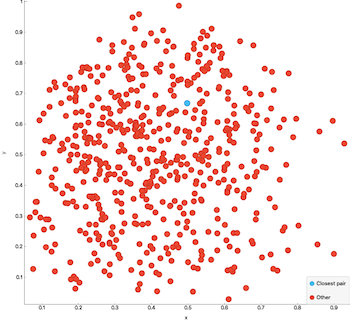
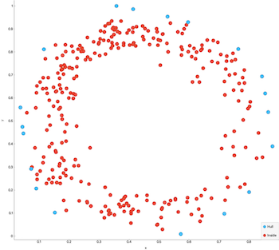
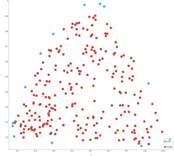

Computational geometry
=============

## Closest pair of points

```cpp
Points ClosestPairOfPoints(const Points& points);
```
Returns the closest pair of points of the input set of 2D-points.

 

## Convex hull

The convex hull is the minimal polygon than contains all the input points. It's like a rubber band around the points.
This implementation is based on the quickhull algorithm.

[Quickhull, Wikipedia.](https://en.wikipedia.org/wiki/Quickhull)

```cpp
Points ConvexHull(Points points);
```

Returns the convex hull of `points`, the convex hull is in the returned `Points`.

 

## Triangulation of 2D-points