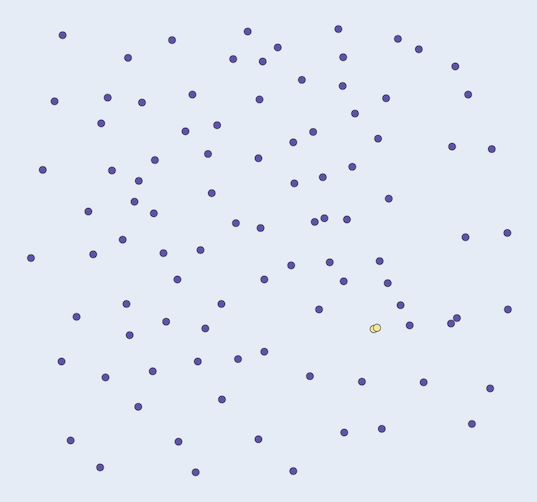
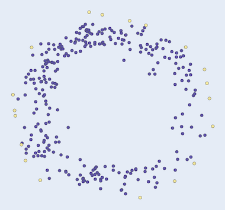
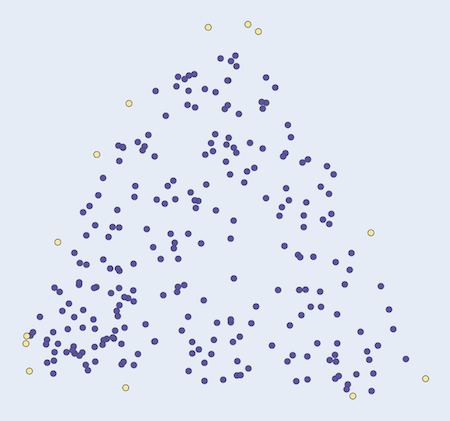
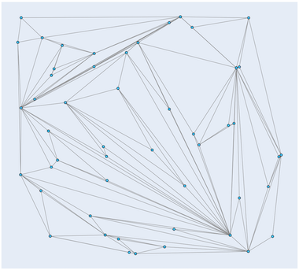
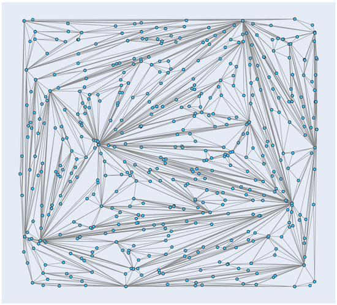

Computational geometry
=============

## Data structures
Namespaces omitted

|Data structure| Description | Example |
|:---|:---|:---|
|`Point`        | 2D cartesian point.               | `Point pt{1,2};` |
|`Line`         | For connecting two points.        | `Line line{Point{1,1}, Point{2,2}};`|
|`Points`       | For storing multiple points.      | `Points pts{{1,1},...,{n,n}};` |
|`Lines`        | For storing multiple lines.       | `Lines lines{{{1,1},{2,2}},...,{{m,m},{n,n}}};`|

## Closest pair of points

```cpp
Points ClosestPairOfPoints(const Points& points);
```
Returns the closest pair of points of the input set of 2D-points.

### Usage
```cpp
#include <algo_geometry.hpp>

using namespace algo::geometry;

...

Points points{{0.15348, 0.355506},
              {0.2904, 0.354303},
              {0.156568, 0.220757},
              {0.292459, 0.224367},
              {0.223484, 0.291741}};

Points qh{ConvexHull(points)};
```
### Example

 

## Convex hull

The convex hull is the minimal polygon than contains all the input points. It's like a rubber band around the points.
This implementation is based on the quickhull algorithm.

[Quickhull, Wikipedia.](https://en.wikipedia.org/wiki/Quickhull)

```cpp
Points ConvexHull(Points points);
```

Returns the convex hull of `points`, the convex hull is in the returned `Points`.

### Usage
```cpp
#include <algo_geometry.hpp>

using namespace algo::geometry;

...

Points points{{0.162745, 0.676737},
              {0.578652, 0.674331},
              {0.201865, 0.252038},
              {0.609536, 0.232788},
              {0.351138, 0.478224},
              {0.365551, 0.491458}};

Points closest{ClosestPairOfPoints(points)};
```

### Examples

 

## Triangulation of 2D-points

```cpp
Lines Triangulate(Points& pts);
```

Triangulates the input points `pts` and returns a set of pair of points in `Lines` where each pair connects two points with an edge.

### Usage

```cpp
using namespace algo::geometry;

...

Points points{{0.112301, 0.440927},
              {0.339814, 0.723659},
              {0.614683, 0.516723},
              {0.414966, 0.294147}};

Lines lines{Triangulate(points)};
```

### Examples

 