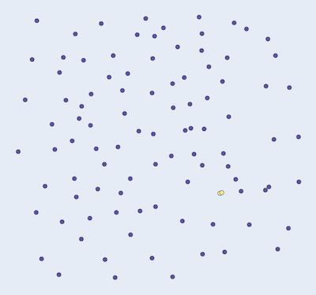

Computational geometry
=============

## Closest pair of points

```cpp
std::vector<algo::geometry::Point> points{...};
Grid grid{points};
auto closest = grid.ClosestPairOfPoints(); // pair
```

Returns the closest pair of points of the input set of 2D-points.

### Usage

### Example

 

## Convex hull

The convex hull is the minimal polygon than contains all the input points. It's like a rubber band around the points.
This implementation is based on the quickhull algorithm.

[Quickhull, Wikipedia.](https://en.wikipedia.org/wiki/Quickhull)

```cpp
std::vector<algo::geometry::Point> points{...};
Grid grid{points};
auto convex_hull = grid.ConvexHull(); // points
```

Returns the convex hull of `points`, the convex hull is in the returned `Points`.

### Examples

 

## Minimum bounding box

```cpp
std::vector<algo::geometry::Point> points{...};
Grid grid{points};
auto polygon = grid.MinBoundingBox();
```

Returns the minimum bounding box of the input points. Note that it's not the same as bounding rectangle, which can be found by looking for the min and max coordinates of the input points. The minimum bounding box is the smallest enclosing rectangle around the input points, which means that the rectangle may be rotated.

This implementation is based on the concept of rotating calipers of a polygon. It starts by finding the convex hull of the input points and then iterates over each edge and rotates the polygon with the angle of the edge with respect to the y-axis and extracts the bounding rectangle each time. When all the rectangles are found, the one with smallest area is returned.

[Rotating calipers, Wikipedia.](https://en.wikipedia.org/wiki/Rotating_calipers)

### Examples

Note that the axis should be adjusted when plotting, otherwise the resulting rectangle might look skew.

  

## Minimum enclosing circle

```cpp
std::vector<algo::geometry::Point> points{...};
Grid grid{points};
auto circle = grid.MinEnclosingCircle();
```

Returns the smallest circle around the points in `pts`.

[Smallest-circle problem](https://en.wikipedia.org/wiki/Smallest-circle_problem)

### Examples

 

 

## Triangulation of 2D-points

```cpp
std::vector<algo::geometry::Point> points{...};
Grid grid{points};
auto lines = grid.Triangulate();
```

Triangulates the input points `pts_` and returns a set of pair of points in `Edges` where each pair connects two points with an edge.

### Examples

 