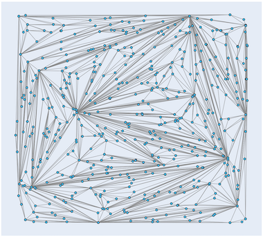

Computational geometry
=============

## Closest pair of points

```cpp
Points ClosestPairOfPoints(const Points& points);
```
Returns the closest pair of points of the input set of 2D-points.

 

## Convex hull

The convex hull is the minimal polygon than contains all the input points. It's like a rubber band around the points.
This implementation is based on the quickhull algorithm.

[Quickhull, Wikipedia.](https://en.wikipedia.org/wiki/Quickhull)

```cpp
Points ConvexHull(Points points);
```

Returns the convex hull of `points`, the convex hull is in the returned `Points`.

 

## Triangulation of 2D-points

```cpp
Edges Triangulate(Points& pts);
```

Triangulates the input points `pts` and returns a set of pair of points in `Edges` where each pair connects two points with an edge.

### Usage

```cpp
using namespace algo::geometry;

...

Points points{{0.112301, 0.440927},
              {0.339814, 0.723659},
              {0.614683, 0.516723},
              {0.414966, 0.294147}};

Edges lines{Triangulate(points)};
```

### Examples

1. Generate data `examples/geometry/triangulate/triangulate_data.py`
2. Compute triangulation `examples/geometry/triangulate/triangulate_example.cpp`
3. Read triangulation data `examples/geometry/triangulae/triangulate_read_result.py`

 

 