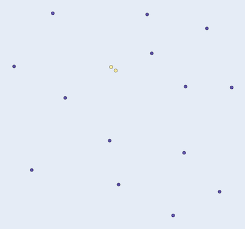

Computational geometry
=============

## Closest pair of points

```cpp
std::vector<algo::geometry::Point> points{...};
Grid grid{points};
auto closest = grid.ClosestPairOfPoints(); // pair
```
Returns the closest pair of points of the input set of 2D-points.

### Example

 

## Convex hull

The convex hull is the minimal polygon than contains all the input points. It's like a rubber band around the points.
This implementation is based on the quickhull algorithm.

```cpp
std::vector<algo::geometry::Point> points{...};
Grid grid{points};
auto convex_hull = grid.ConvexHull(); // points
```

Returns the convex hull of `points`, the convex hull is in the returned `Points`.

### Examples

 

## Minimum bounding box

```cpp
std::vector<algo::geometry::Point> points{...};
Grid grid{points};
auto polygon = grid.MinBoundingBox();
```

Returns the **minimum** bounding box of the input points.

### Examples

Note that the axis should be adjusted when plotting, otherwise the resulting rectangle might look skew.

 
## Minimum enclosing circle

```cpp
std::vector<algo::geometry::Point> points{...};
Grid grid{points};
auto circle = grid.MinEnclosingCircle();
```

Returns the minimum enclosing circle around the points in `pts`.

[Smallest-circle problem](https://en.wikipedia.org/wiki/Smallest-circle_problem)

### Examples

 

## Triangulation of 2D-points

```cpp
std::vector<algo::geometry::Point> points{...};
Grid grid{points};
auto lines = grid.Triangulation();
```

Triangulates the input points `pts_` and returns a set of pair of points in `Edges` where each pair connects two points with an edge.

### Examples

 

## Delaunay triangulation

```cpp
  Points points{...};
  Grid grid{points};
  auto de_tri = grid.DelaunayTriangulation();
```
Makes a Delaunay triangulation of the input points. `DelaunayTriangulation` returns the
edges of the triangulation.

### Examples

 