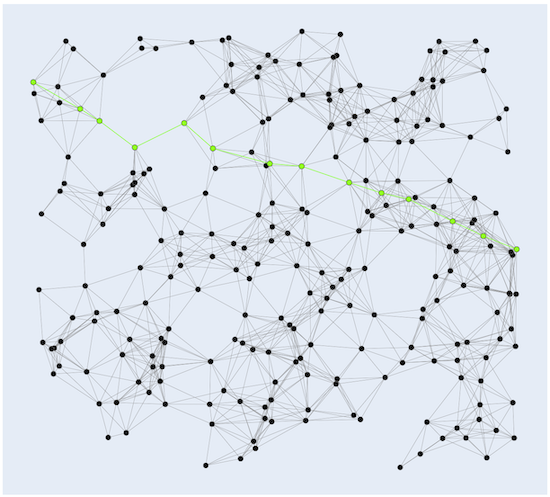
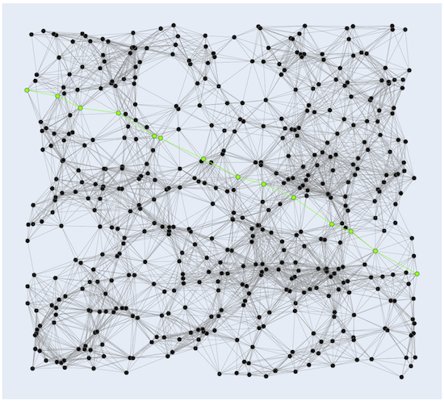
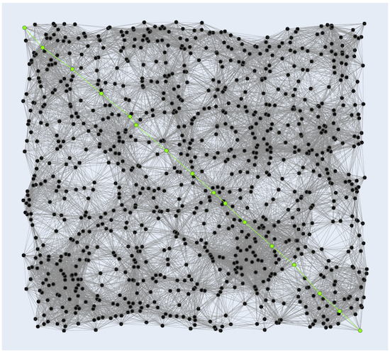

Graph algorithms
========

## Dijkstra's algorithm for shortest path

Dijkstra's algorithm finds the shortest path between nodes in a graph. 

```cpp
Nodes ShortestPathAll(const Graph &graph, const int &source);

Nodes ShortestPath(const Graph &graph, const int &source, const int &dest);
```

The first function returns all the shortest paths in `graph` from `source` to any other node. The returned list with nodes 
can construct the path by checking the previous node `prev = nodes[prev]`.

To get the path from `source` to `dest`, the second function returns this path.

### Usage

```cpp
using namespace algo::graph;  

...

Graph graph{NewGraph(6)};   // 6 == number of nodes
MakeEdge(graph, 0, 2, 2.0); // Graph, node, node, weight
MakeEdge(graph, 0, 1, 4.0);
MakeEdge(graph, 1, 2, 1.0);
MakeEdge(graph, 1, 3, 5.0);
MakeEdge(graph, 2, 3, 8.0);
MakeEdge(graph, 2, 4, 10.0);
MakeEdge(graph, 4, 5, 3.0);
MakeEdge(graph, 3, 4, 2.0);
MakeEdge(graph, 3, 5, 6.0);

Nodes correct{0, 2, 1, 3, 4, 5};
Nodes nodes{ShortestPath(graph, 0, 5)};
```

### Examples

1. Generate data `examples/graph/shortest_path/shortest_path_data.py`
2. Compute Dijkstra's shortest path `examples/graph/shortest_path/shortest_path_example.cpp`
3. Show result `examples/graph/shortest_path/shortest_path_read_result.py`

 

   

## Prim's algorithm for minimum spanning trees

> A minimum spanning tree (MST) or minimum weight spanning tree is a subset of the edges of a connected, edge-weighted 
>undirected graph that connects all the vertices together, without any cycles and with the minimum possible total edge 
>weight. That is, it is a spanning tree whose sum of edge weights is as small as possible. 
> [Wikipedia](https://en.wikipedia.org/wiki/Minimum_spanning_tree).

```cpp
Graph MinimumSpanningTree(const Graph &graph, const int &source, int &total_weight);
```
Computes the minimum spanning tree of`graph` from the starting node `source`. The minimum total weight is saved in `total_weight`.

### Usage

```cpp
using namespace algo::graph;

...

Graph G{NewGraph(7)};     // 7 == number of nodes
MakeEdge(G, 0, 1, 16.0);  // Graph, node, node, weight
MakeEdge(G, 0, 3, 21.0);
MakeEdge(G, 0, 2, 12.0);
MakeEdge(G, 1, 4, 20.0);
MakeEdge(G, 1, 3, 17.0);
MakeEdge(G, 2, 3, 28.0);
MakeEdge(G, 3, 4, 18.0);
MakeEdge(G, 3, 6, 23.0);
MakeEdge(G, 3, 5, 19.0);
MakeEdge(G, 3, 5, 31.0);
MakeEdge(G, 4, 6, 11.0);
MakeEdge(G, 5, 6, 27.0);

int total_weight{0};
Graph gmst{MinimumSpanningTree(G, 0, total_weight)};
```

### Examples

1. Generate data `examples/graph/mst/mst_data.py`
2. Compute Prim's MST `examples/graph/mst/mst_example.cpp`
3. Show result `examples/graph/mst/mst_read_result.py`

The weights are the Euclidean distance betwen two nodes.

 

 

