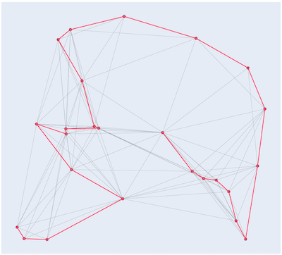
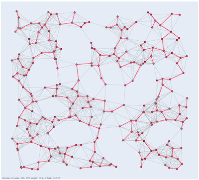

Graph algorithms
========

#### Cheat sheet

| Function  | Algorithm  |  Weighted | Directed  |
|---|---|---|---|
| `BFS`| Breadth-First-Search | No| Any |
| `ShortestPathBFS`| Breadth-First-Search | No| Any |
| `IsBipartite`| Breadth-First-Search| No | No |
| `AllNodesPath`  | Nearest neighbor  | Yes `+`  | No  |
| `ShortestPathDijkstra`  | Dijkstra  | Yes `+`  | Any  |
| `ShortestPathBF` | Bellman-Ford | Yes `+ -` | Yes |
| `ShortestPathAllPairs` | Floyd-Warshall | Yes `+ -` | Yes|
| `MinSpanningTree` | Prims  | Yes `+`  | No  |
| `MaxFlow` | Edmonds-Karp | Yes `+ -` | Yes |
|`StrConnComponents`| Kosaraju | No | Yes |
 
## Breadth-First-Search (BFS)
>Breadth-first search (BFS) is an algorithm for traversing or searching tree or graph data structures. 
>It starts at the tree root (or some arbitrary node of a graph, sometimes referred to as a 'search key'), 
>and explores all of the neighbor nodes at the present depth prior to moving on to the nodes at the next depth level.
>[Wikipedia](https://en.wikipedia.org/wiki/Breadth-first_search)

```cpp
Nodes BFS(const Graph &graph, const int &source);
```
Returns the nodes constructing the shortest paths from each destination node to the `source` node. To backtrack 
assign `prev = destination` then `prev = path[prev]`

## Shortest path BFS

```cpp
Nodes ShortestPathBFS(const Graph &graph, const int &source, const int &dest);
```
Return the shortest path from `source` to `dest` in then input `graph` using breadth-first-search. The distance 
between nodes is measured in number of edges, which is different from e.g. Dijkstra's and Bellman-Ford's algorithms 
that use weights.

### Usage

```cpp
using namespace algo::graph;

...

Graph graph{NewGraph(5)};
MakeDirEdge(graph, 0, 1);
MakeDirEdge(graph, 0, 2);
MakeDirEdge(graph, 1, 3);
MakeDirEdge(graph, 2, 4);
MakeDirEdge(graph, 3, 4);

Nodes shortest_path{ShortestPathBFS(graph, 0, 4)}; // (0)->(2)->(4)
```
>

## Bipartiteness
>A bipartite graph is a graph whose vertices can be divided into two disjoint and independent sets 
>U and V such that every edge connects a vertex in U to one in V. [Wikipedia](https://en.wikipedia.org/wiki/Bipartite_graph#Testing_bipartiteness)

```cpp
bool IsBipartite(const Graph &graph);
```
Returns `true` if `graph` is bipartite.

### Usage
```cpp
using namespace algo::graph;

...

Graph graph{NewGraph(6)};
MakeEdge(graph, 0, 1);
MakeEdge(graph, 0, 2);
MakeEdge(graph, 1, 3);
MakeEdge(graph, 2, 4);
MakeEdge(graph, 3, 5);
MakeEdge(graph, 4, 5);

bool is_bipartite{IsBipartite(graph)}; // true
```

## Nearest neighbor for approximation of the travelling salesman problem

>The travelling salesman problem asks the following 
>question: "Given a list of cities and the distances between each pair of cities, what is the shortest possible 
>route that visits each city and returns to the origin city? [Wikipedia](https://en.wikipedia.org/wiki/Travelling_salesman_problem)

```cpp
Nodes AllNodesPath(const Graph &graph, const int &source)
```

Returns the path of the input `graph`, that hopefully visits all nodes. There's no guarantee that it is the optimal 
(shortest) path that visits all nodes. However it's an appoximation and could be close to. Furthermore, the 
algorithm does not always find a path.
In this implementation, if no path was found then the next node will be used as source until there are no more nodes to 
try.

Note that this algorithm can be very slow for large input.


### Usage

```cpp
using namespace algo::graph;

...

Graph graph{NewGraph(5)};
MakeEdge(graph, 0, 1, 70.0);
MakeEdge(graph, 0, 2, 35.0);
...
MakeEdge(graph, 2, 4, 12.0);
MakeEdge(graph, 3, 4, 15.0);

Nodes nodes{AllNodesPath(graph, 4)};
```

### Examples

_The Euclidean distance betweean a pair of nodes is used as weight._

 


## Dijkstra's algorithm for shortest path

Dijkstra's algorithm finds the shortest path between nodes in a graph. 

```cpp
Nodes ShortestPathDijkstra(const Graph &graph, const int &source, const int &dest);
```

Returns a list with the nodes that constructs the shortest path from `source` to `dest` in the input `graph`.

### Usage

```cpp
using namespace algo::graph;  

...

Graph graph{NewGraph(6)};   // 6 == number of nodes
MakeEdge(graph, 0, 2, 2.0); // Graph, node, node, weight
MakeEdge(graph, 0, 1, 4.0);
...
MakeEdge(graph, 3, 4, 2.0);
MakeEdge(graph, 3, 5, 6.0);

Nodes correct{0, 2, 1, 3, 4, 5};
Nodes nodes{ShortestPathDijkstra(graph, 0, 5)};
```

### Examples

_The Euclidean distance betweean a pair of nodes is used as weight._

 

   

## Bellman-Ford's algorithm for shortest path

Computes the shortest distance between a source node and all other nodes. Dijkstra's algorithm does the same thing and faster but BF can handle graphs with negative weights between nodes.

```cpp
std::pair<Weights, Nodes> ShortestPathBF(const Graph &graph, const int &source);
```

Returns the shortest paths from `source` to all aother nodes in `graph` and the minimum weights for each path.

```cpp
std::pair<Nodes, double> ShortestPathBF(const Graph &graph, const int &source, const int &dest);
```

Returns the shortest path from `source` to `dest` in `graph`.

### Usage

```cpp
using namespace algo::graph;

...

Graph graph{NewGraph(6)};
MakeDirEdge(graph, 0, 1, 10.0);
MakeDirEdge(graph, 0, 5, 8.0);
...
MakeDirEdge(graph, 4, 1, -4.0);
MakeDirEdge(graph, 5, 4, 1.0);

pair<Weights, Nodes> res{ShortestPathBF(graph, 0)};
```

## Floyd-Warshall all node-pairs shortest path
>[Floyd-Warshall]...is an algorithm for finding shortest paths in a weighted graph with positive or negative edge weights (but with no 
>negative cycles) ... A single execution of the algorithm will find the lengths (summed weights) of shortest paths between 
>all pairs of vertices. [Wikipedia](https://en.wikipedia.org/wiki/Floyd–Warshall_algorithm)


### All pair-paths
```cpp
NodeMat ShortestDistAllPairs(const Graph &graph);
```
Returns all the shortest path from any node in the returned `NodeMat` to any other node in `graph.`

#### Usage

```cpp
TODO
```

### Shortest single path


```cpp
Nodes ShortestDistAllPairsPath(const Graph &graph, const int &source, const int &dest);
```
Returns a single paht from `source` to `dest` in the input `graph.`.

#### Usage

```cpp
using namespace algo::graph;

...

Graph graph{NewGraph(4)};
MakeDirEdge(graph, 0, 1, 2);
MakeDirEdge(graph, 0, 2, 1);
...
MakeDirEdge(graph, 2, 3, 3);
MakeDirEdge(graph, 3, 0, 4);

Nodes path{ShortestDistAllPairsPath(graph, 0, 3)};
```

## Prim's algorithm for minimum spanning trees

> A minimum spanning tree (MST) or minimum weight spanning tree is a subset of the edges of a connected, edge-weighted 
>undirected graph that connects all the vertices together, without any cycles and with the minimum possible total edge 
>weight. That is, it is a spanning tree whose sum of edge weights is as small as possible. 
> [Wikipedia](https://en.wikipedia.org/wiki/Minimum_spanning_tree).

```cpp
Graph MinSpanningTree(const Graph &graph, const int &source, int &total_weight);
```
Computes the minimum spanning tree of `graph` from the starting node `source`. The minimum total weight is saved in `total_weight`.

### Usage

```cpp
using namespace algo::graph;

...

Graph G{NewGraph(7)};     // 7 == number of nodes
MakeEdge(G, 0, 1, 16.0);  // Graph, node, node, weight
MakeEdge(G, 0, 3, 21.0);
...
MakeEdge(G, 4, 6, 11.0);
MakeEdge(G, 5, 6, 27.0);

int total_weight{0};
Graph gmst{MinSpanningTree(G, 0, total_weight)};
```

### Examples

_The Euclidean distance betweean a pair of nodes is used as weight._

 

## Max-flow

>In optimization theory, maximum flow problems involve finding a feasible flow through a flow network that obtains the 
>maximum possible flow rate. [Wikipedia](https://en.wikipedia.org/wiki/Maximum_flow_problem).

This implementation uses the Edmonds-Karp version of Ford-Fulkerson (BFS instead of DFS).

```cpp
double MaxFlow(Graph graph, const int &source, const int &dest);
```

Returns the maximum flow from `source` to `dest` in `graph`. 

There are examples of non-terminating examples [Wikipedia](https://en.wikipedia.org/wiki/Ford–Fulkerson_algorithm).
This implementation does not check for this. 

### Usage
```cpp
using namespace algo::graph;

...

Graph graph{NewGraph(6)};
MakeDirEdge(graph, 0, 1, 160.0);
MakeDirEdge(graph, 0, 2, 130.0);
...
MakeDirEdge(graph, 3, 5, 200.0);
MakeDirEdge(graph, 4, 5, 40.0);

double max_flow(MaxFlow(graph, 0, 5));
```

## Kosaraju's algorithm for strongly connected components

>In the mathematical theory of directed graphs, a graph is said to be strongly connected if every vertex is reachable 
>from every other vertex. The strongly connected components of an arbitrary directed graph form a partition into 
>subgraphs that are themselves strongly connected. [Wikipedia](https://en.wikipedia.org/wiki/Strongly_connected_component)

```cpp
NodeMat StrConnComponents(const Graph &graph)
```

Computes the strongly connected components (SCC) of the input `graph`. `NodeMat` is a list of `Nodes`.
Each item in the output forms a sub-graph of `graph`, where each sub-graph is one SCC.

### Usage

```cpp
using namespace algo::graph;

...

Graph graph{NewGraph(5)};
MakeDirEdge(graph, 1, 0);
MakeDirEdge(graph, 2, 1);
MakeDirEdge(graph, 0, 2);
MakeDirEdge(graph, 0, 3);
MakeDirEdge(graph, 3, 4);

NodeMat scc{StrConnComponents(graph)};
```