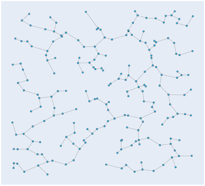

Graph algorithms
========

## Nearest neighbor for approximation of the travelling salesman problem

>The travelling salesman problem asks the following 
>question: "Given a list of cities and the distances between each pair of cities, what is the shortest possible 
>route that visits each city and returns to the origin city? [Wikipedia](https://en.wikipedia.org/wiki/Travelling_salesman_problem)

```cpp
Nodes AllNodesPath(const Graph &graph, const int &source)
```

Returns the path of the input `graph`, that hopefully visits all nodes. There's no guarantee that it is the optimal 
(shortest) path that visits all nodes. However it's an appoximation and could be close to. Furthermore, the 
algorithm does not always find a path.
In this implementation, if no path was found then the next node will be used as source until there are no more nodes to 
try.

Note that this algorithm can be very slow for large input.


### Usage

```cpp
using namespace algo::graph;

...

Graph graph{NewGraph(5)};
MakeEdge(graph, 0, 1, 70.0);
MakeEdge(graph, 0, 2, 35.0);
...
MakeEdge(graph, 2, 4, 12.0);
MakeEdge(graph, 3, 4, 15.0);

Nodes nodes{AllNodesPath(graph, 4)};
```

### Examples

 


## Dijkstra's algorithm for shortest path

Dijkstra's algorithm finds the shortest path between nodes in a graph. 

```cpp
Nodes ShortestPathAll(const Graph &graph, const int &source);

Nodes ShortestPath(const Graph &graph, const int &source, const int &dest);
```

The first function returns all the shortest paths in `graph` from `source` to any other node. The returned list with nodes 
can construct the path by checking the previous node `prev = nodes[prev]`.

To get the path from `source` to `dest`, the second function returns this path.

### Usage

```cpp
using namespace algo::graph;  

...

Graph graph{NewGraph(6)};   // 6 == number of nodes
MakeEdge(graph, 0, 2, 2.0); // Graph, node, node, weight
MakeEdge(graph, 0, 1, 4.0);
MakeEdge(graph, 1, 2, 1.0);
MakeEdge(graph, 1, 3, 5.0);
MakeEdge(graph, 2, 3, 8.0);
MakeEdge(graph, 2, 4, 10.0);
MakeEdge(graph, 4, 5, 3.0);
MakeEdge(graph, 3, 4, 2.0);
MakeEdge(graph, 3, 5, 6.0);

Nodes correct{0, 2, 1, 3, 4, 5};
Nodes nodes{ShortestPath(graph, 0, 5)};
```

### Examples

1. Generate data `examples/graph/shortest_path/shortest_path_data.py`
2. Compute Dijkstra's shortest path `examples/graph/shortest_path/shortest_path_example.cpp`
3. Show result `examples/graph/shortest_path/shortest_path_read_result.py`

 

   

## Prim's algorithm for minimum spanning trees

> A minimum spanning tree (MST) or minimum weight spanning tree is a subset of the edges of a connected, edge-weighted 
>undirected graph that connects all the vertices together, without any cycles and with the minimum possible total edge 
>weight. That is, it is a spanning tree whose sum of edge weights is as small as possible. 
> [Wikipedia](https://en.wikipedia.org/wiki/Minimum_spanning_tree).

```cpp
Graph MinimumSpanningTree(const Graph &graph, const int &source, int &total_weight);
```
Computes the minimum spanning tree of`graph` from the starting node `source`. The minimum total weight is saved in `total_weight`.

### Usage

```cpp
using namespace algo::graph;

...

Graph G{NewGraph(7)};     // 7 == number of nodes
MakeEdge(G, 0, 1, 16.0);  // Graph, node, node, weight
MakeEdge(G, 0, 3, 21.0);
MakeEdge(G, 0, 2, 12.0);
MakeEdge(G, 1, 4, 20.0);
MakeEdge(G, 1, 3, 17.0);
MakeEdge(G, 2, 3, 28.0);
MakeEdge(G, 3, 4, 18.0);
MakeEdge(G, 3, 6, 23.0);
MakeEdge(G, 3, 5, 19.0);
MakeEdge(G, 3, 5, 31.0);
MakeEdge(G, 4, 6, 11.0);
MakeEdge(G, 5, 6, 27.0);

int total_weight{0};
Graph gmst{MinimumSpanningTree(G, 0, total_weight)};
```

### Examples

1. Generate data `examples/graph/mst/mst_data.py`
2. Compute Prim's MST `examples/graph/mst/mst_example.cpp`
3. Show result `examples/graph/mst/mst_read_result.py`

The weights are the Euclidean distance betwen two nodes.

 

 

