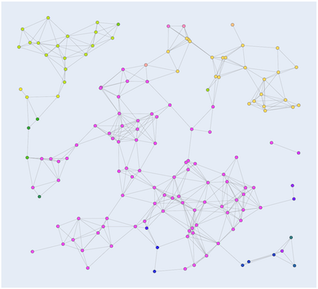
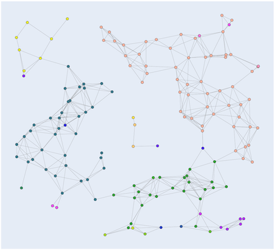

Graph algorithms
========

|                                Function | `UG` | `DG` | `UWG` | `DWG` | Weights |
|----------------------------------------:|:----:|:----:|:-----:|:-----:|:-------:|
|                                   `BFS` |  ✅   |  ✅   |       |       |         |
|                       `ShortestPathBFS` |  ✅   |  ✅   |       |       |         |
|                           `IsBipartite` |  ✅   |      |       |       |         |
|   `StronglyConnectedComponentsKosaraju` |      |  ✅   |       |       |         |
|                       `MinSpanningTreePrim` |      |      |   ✅   |       |    ➕    |
|                  `ShortestPathDijkstra` |      |      |   ✅   |   ✅   |    ➕    |
|               `ShortestPathBellmanFord` |      |      |       |   ✅   |   ➕➖    |
|     `ShortestPathSinglePathBellmanFord` |      |      |       |   ✅   |   ➕➖    |
|     `ShortestDistAllPairsFloydWarshall` |      |      |       |   ✅   |   ➕➖    |
| `ShortestDistAllPairsPathFloydWarshall` |      |      |       |   ✅   |   ➕➖    |
|                    `MaxFlowEdmondsKarp` |      |      |       |   ✅   |   ➕➖    |

⚫️ `UG` = `UndirectedGraph` ⚫`DG` = `DirectedGraph` ⚫ `UWG` = `UndirectedWeightedGraph` ⚫`DWG` = `DirectedWeightedGraph`

## Bipartiteness

> A bipartite graph is a graph whose vertices can be divided into two disjoint and independent sets
> U and V such that every edge connects a vertex in U to one in V. [Wikipedia](https://en.wikipedia.org/wiki/Bipartite_graph#Testing_bipartiteness)

```cpp
UndirectedGraph ug{N};
// ...
const auto is_bipartite = IsBipartite();
```

Returns `true` if `graph` is bipartite.

## Shortest paths

### Unweighted graphs

```cpp
UndirectedGraph ug{N};
// ... (Insert edges)
const auto nodes = ug.BFS(source, dest);
```

or

```cpp
DirectedGraph dg{N};
// ...
const auto nodes = dg.BFS(source, dest);
```

Returns the nodes constructing the shortest paths from each destination node to
the `source` node. To backtrack assign `prev = destination` then `prev = path[prev]`

```cpp
UndirectedGraph ug{N};
// ...
const auto path = ug.ShortestPathBFS(source, dest);
```

or

```cpp
DirectedGraph dg{N};
// ...
const auto path = dg.ShortestPathBFS(source, dest);
```

Return the shortest path from `source` to `dest` using breadth-first-search.
The distance between nodes is measured in number of edges, which is different
from e.g. Dijkstra's and Bellman-Ford's algorithms  that use weights.


### Graphs with positive edge weights

Dijkstra's algorithm finds the shortest path between nodes in a graph with all 
positive weights.

```cpp
UndirectedWeightedGraph uwg{N};
// ...
const auto nodes = uwg.ShortestPathDijkstra(source, dest);
```

or

```cpp
DirectedWeightedGraph dwg{N};
// ...
const auto nodes = dwg.ShortestPathDijkstra(source, dest);
```

Returns the shortest path from node `source` to `dest`.

### Examples

The Euclidean distance betweean a pair of nodes is used as weight.

 

### Positive and negative edge weights

Dijkstra's algorithm for finding the shortest paths does only work on graphs
with positive edge weights. When there are negative edge weights, the 
Bellman-Ford algorithm can be used instead.

```cpp
DirectedWeightedGraph dwg{N};
// ...
const auto weights_n_nodes = ShortestPathBellmanFord(source);
const auto weights = weights_n_nodes.first;
const auto paths = weights_n_nodes.second;
```

Returns the shortest paths from `source` to all other nodes and the minimum weights for each path.

```cpp
DirectedWeightedGraph dwg{N};
// ...
const auto path_n_weight = dwg.ShortestPathSinglePathBellmanFord(source, dest);
const auto path = path_n_weights.first;
const auto weight = path_n_weight.second;
```

Returns the shortest path and the total weight from `source` to `dest`.

### Finding all node-pairs shortest paths

> [Floyd-Warshall]...is an algorithm for finding shortest paths in a weighted graph with positive or negative edge weights (but with no
> negative cycles) ... A single execution of the algorithm will find the lengths (summed weights) of shortest paths between
> all pairs of vertices. [Wikipedia](https://en.wikipedia.org/wiki/Floyd–Warshall_algorithm)

```cpp
DirectedWeightedGraph dwg{N};
// ...
const auto node_mat = dwg.ShortestDistAllPairsFloydWarshall()
```

Returns all the shortest path from any node in the returned `NodeMat` to any other node in `graph.`

```cpp
DirectedWeightedGraph dwg{N};
// ...
const auto nodes = dwg.ShortestDistAllPairsPathFloydWarshall(source, dest);
```

Returns a single path from `source` to `dest`.

## Minimum spanning trees

> A minimum spanning tree (MST) or minimum weight spanning tree is a subset of the edges of a connected, edge-weighted
> undirected graph that connects all the vertices together, without any cycles and with the minimum possible total edge
> weight. That is, it is a spanning tree whose sum of edge weights is as small as possible.
> [Wikipedia](https://en.wikipedia.org/wiki/Minimum_spanning_tree).

```cpp
UndirectedWeightedGraph uwg{N};
// ...
double total_weight;
const auto mst = uwg.MinSpanningTreePrim(total_weight);
```

Returns the MST. The minimum total weight is saved in `total_weight`.

### Examples

The Euclidean distance betweean a pair of nodes is used as weight.

 

## Max-flow

> In optimization theory, maximum flow problems involve finding a feasible flow through a flow network that obtains the
> maximum possible flow rate. [Wikipedia](https://en.wikipedia.org/wiki/Maximum_flow_problem).

This implementation uses the Edmonds-Karp version of Ford-Fulkerson (BFS instead of DFS).

```cpp
DirectedWeightedGraph dwg{N};
// ...
const auto max_flow = dwg.MaxFlowEdmondsKarp(source, dest);
```

Returns the maximum flow from `source` to `dest`.

There are examples of non-terminating examples [Wikipedia](https://en.wikipedia.org/wiki/Ford–Fulkerson_algorithm).
This implementation does not check for this.

## Strongly connected components

> In the mathematical theory of directed graphs, a graph is said to be strongly connected if every vertex is reachable
> from every other vertex. The strongly connected components of an arbitrary directed graph form a partition into
> subgraphs that are themselves strongly connected. [Wikipedia](https://en.wikipedia.org/wiki/Strongly_connected_component)

```cpp
DirectedGraph dg{N};
// ...
const auto node_mat = StronglyConnectedComponentsKosaraju();
```

Computes the strongly connected components. `NodeMat` is a list of `Nodes`.
Each item in the output is a sub-graph, where each sub-graph is one SCC.

### Examples

 
