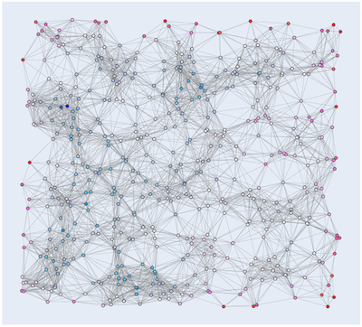

Graph algorithms
========

## Prim's algorithm for minimum spanning trees

> A minimum spanning tree (MST) or minimum weight spanning tree is a subset of the edges of a connected, edge-weighted 
>undirected graph that connects all the vertices together, without any cycles and with the minimum possible total edge 
>weight. That is, it is a spanning tree whose sum of edge weights is as small as possible. 
> [Wikipedia](https://en.wikipedia.org/wiki/Minimum_spanning_tree).

```cpp
Graph MinimumSpanningTree(const Graph &graph, const int &source, int &total_weight);
```
Computes the minimum spanning tree of`graph` from the starting node `source`. The minimum total weight is saved in `total_weight`.

### Usage

```cpp
using namespace algo::graph;

...

Graph G{NewGraph(7)};  // 7 == number of nodes
MakeEdge(G, 0, 1, 16); // Graph, node, node, weight
MakeEdge(G, 0, 3, 21);
MakeEdge(G, 0, 2, 12);
MakeEdge(G, 1, 4, 20);
MakeEdge(G, 1, 3, 17);
MakeEdge(G, 2, 3, 28);
MakeEdge(G, 3, 4, 18);
MakeEdge(G, 3, 6, 23);
MakeEdge(G, 3, 5, 19);
MakeEdge(G, 3, 5, 31);
MakeEdge(G, 4, 6, 11);
MakeEdge(G, 5, 6, 27);

int total_weight{0};
Graph gmst{MinimumSpanningTree(G, 0, total_weight)};
```

### Examples

1. Generate data `examples/graph/mst_data.py`
2. Compute MST `examples/graph/mst_example.cpp`
3. Read MST data `examples/mst_read_result.py`

200 Nodes

 

500 nodes

 
