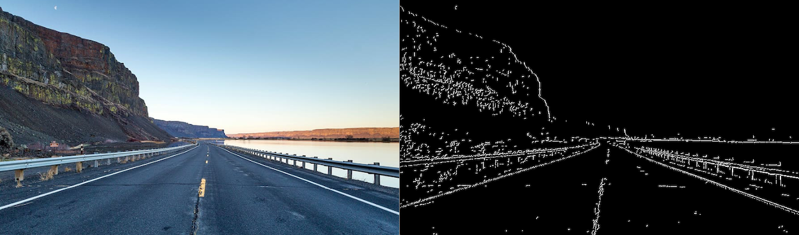
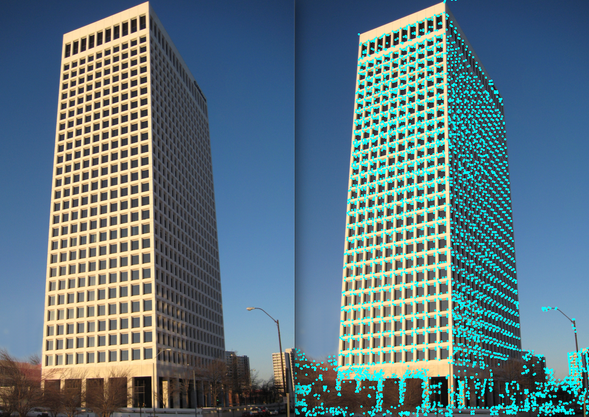

Image object detection alorithms
===================================

| Function  | Algorithm  | Type  |
|---|---|---|
|`CannyEdge`| Canny | Edge detection |
| `LinesHough` | Canny + Hough transform | Line detection |
| `Corners` | Harris or Shi-Tomasi | Corner detection |

## Edge detection
To find edges in some input image, the Canny edge detection algorithm is used. Note that this is not a line detection
 algorithm, an edge is not always a (straight) line. There are simpler ways to find edges in the input image, the Sobel operator can find edges
  in the horizontal and vertical direction. The Canny edge detector normally detects high quality edges.
  
[Canny edge detector, Wikipedia.](https://en.wikipedia.org/wiki/Canny_edge_detector)
  
```cpp
Img detect::CannyEdge(const Img& im, const int& threshold_min = 31, const int& threshold_max = 91);
```
Returns an image with the detected edges. `threshold_min`and `threshold_max` define the double threshold. In the
 Canny algorithm, a candidate edge pixel is set to strong when the pixel is over `threshold_max`, if the pixel is
  less than `threshold_max` but greater tha `threshold_min` then it's marked as weak. A weak edge is kept if it's in
   a neighborhood where some strong edge exists.
   
 ### Usage
```cpp
using namespace algo::image;

...

cons int kThreshMin{30};
const int kTreshMax{100};
// im must be a gray-scale image
Img im{detect::CannyEdge(im, kThreshMin, kTreshMax)};
```

### Examples

Source code in `examples/image/detection/detect_canny_edges_example.cpp`.




## Line detection
The Hough transform is a central piece in the line detection algorithm. To learn how the algorithm determines where
 the lines are located in the input image go to the Wikipedia link below.
 
 [Hough transform, Wikipedia.](https://en.wikipedia.org/wiki/Hough_transform)
 
```cpp
Lines detect::LinesHough(const Img& im, const int& n, const int& min_line_dist, const int& min_line_sep = 10);
```
Returns a list of lines detected in the input image `im`, `n` is the maximum number of lines to return, note that the
 algorithm gives no guarantee that it find `n` lines. `min_line_dist` is the minimum lenght of a detected line and
  `min_line_sep` is a threshold to filter lines that are too close to each other.
  
### Usage
```cpp
#using namespace algo::image

...

//im_in is an input image.
Img im{detect::CannyEdge(im_in, kThreshMin, kTreshMax)};
Lines lines{detect::LinesHough(im, kNbrLines, kMinLineDist, 10)};
```

### Examples
Source code in `examples/image/detect_hough_lines_example.cpp`.


## Corner detection
A traditional corner detector uses some way to measure how much a pixel is a corner. This library offers the Harris- and
 Shi-Tomasi- cornerness calculations.
 
[Corner detectors, WIkipedia.](https://en.wikipedia.org/wiki/Corner_detection)
 
[Lecture notes, Saad J Bedros, University of Minnesota.](https://bit.ly/2XzCuis)
 
```cpp
Points detect::Corners(const Img& im, const int& threshold, const CornerDetType& det_type = CornerDetType::kHarris,
                       const int& n_best = 0, const int& min_dist = 0,
                       const GaussWindowSettings& g_win_set = {Size{7, 7}, 1.0});
```
Returns a list of coordinates of corners in the input image `im`. By default, the `CornerDetType:kHarris
` (`CornerDetType::kShiTomasi`) is
 selected
. The user chan select to get the `n_best`, the n corners with the highest measure of corner. It's also possible to
 select the minimum distance between two pair of points, `min_dist`. To vary the quality of found corners, it's
  recommended to tweak the Gaussian kernel window size and standard deviation in `g_win_set`. Note that the window
   dimensions must be odd integers.
   
 The computation speed is dependent on the image size and the other input parameters.
   
 ### Usage
 ```cpp
using namespace algo:image;

... 

Points points{detect::Corners(im, 9e2, detect::CornerDetType::kShiTomasi, 0, 4, {5, 5, 1.0})};
 ```

### Examples

 

 

