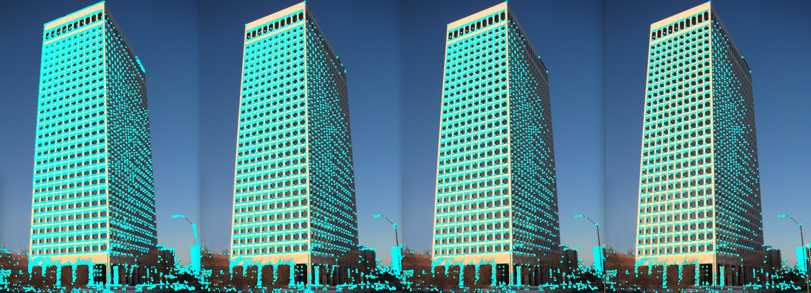
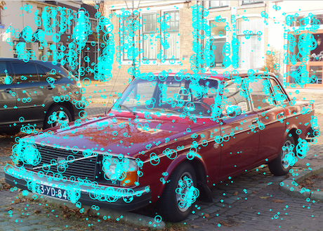
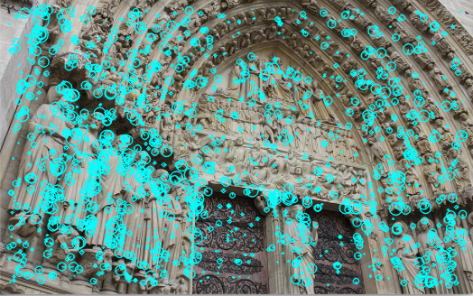
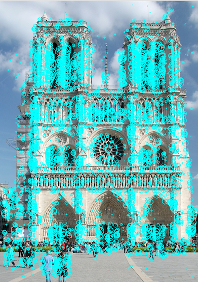
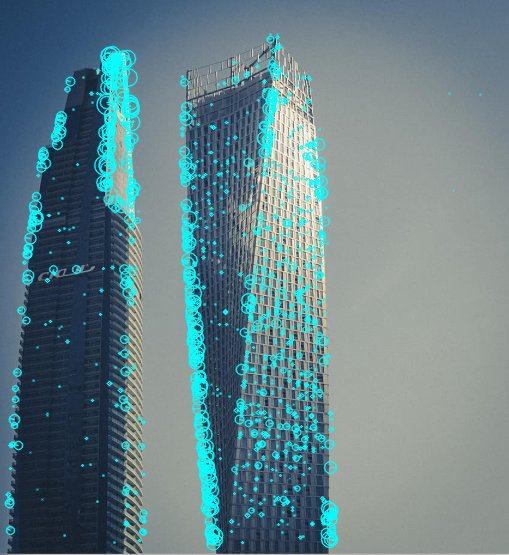

Feture extraction algorithms
==========================

## Hough transform
The Hough transform is mainly used in line detection. At least in this library. This function enables line detection
 but is of course free to use for other purposes. Note that this is not a generalized Hough transform, which means
  that the purpose is line detection.
  
[Hough transform, Wikipedia.](https://en.wikipedia.org/wiki/Hough_transform)

```cpp
Img feature::HoughTransform(const Img& im);
```
Returs the Hough transform as a new image. The image can now be used to search for local maximums (lines).

## Usage
```cpp
#include "algo.hpp"

using namespace algo::image;

...

// im is a gray-scale image
Img imh{feature::HoughTransform(im)};
```

### Examples


## Corner detection

### Eigenvalue based detectors, Harris and Shi-Tomasi
A traditional corner detector uses some way to measure how much a pixel is a corner. This library offers the Harris- and
 Shi-Tomasi- cornerness calculations.
 
[Corner detectors, WIkipedia.](https://en.wikipedia.org/wiki/Corner_detection)
 
[Lecture notes, Saad J Bedros, University of Minnesota.](https://bit.ly/2XzCuis)
 
```cpp
Points feature::Corners(const Img& im, const int& threshold, const CornerDetType& det_type = CornerDetType::kHarris,
                       const int& n_best = 0, const int& min_dist = 0,
                       const GaussWindowSettings& g_win_set = {Size{7, 7}, 1.0});
```
Returns a list of coordinates of corners in the input image `im`. By default, the `CornerDetType:kHarris
` (`CornerDetType::kShiTomasi`) is
 selected
. The user chan select to get the `n_best`, the n corners with the highest measure of corner. It's also possible to
 select the minimum distance between two pair of points, `min_dist`. To vary the quality of found corners, it's
  recommended to tweak the Gaussian kernel window size and standard deviation in `g_win_set`. Note that the window
   dimensions must be odd integers.
   
 The computation speed is dependent on the image size and the other input parameters.
   
 #### Usage
 ```cpp
#include "algo.hpp"

using namespace algo:image;

... 

Points points{feature::Corners(im, 9e2, feature::CornerDetType::kShiTomasi, 0, 4, {5, 5, 1.0})};
 ```

#### Examples

 

 

### FAST Corner detector
> Features from accelerated segment test (FAST) is a corner detection method, which could be used to extract feature points and later used to track and map objects in many computer vision tasks.
> [...] The most promising advantage of the FAST corner detector is its computational efficiency.

To find a corner with this algoritm, every candidate pixel is compared with the 16 surrounding pixels forming
the [Bresenham](https://en.wikipedia.org/wiki/Midpoint_circle_algorithm) circle. If 11 continuous pixels in 
the circle are either darker or brighter than the candidate pixel (+- some threshold) then the conditions are met.

```c++
Points FASTCorners(const Img& im, const int& intensity_threshold, const int& corner_threshold = 11);
```
Returns the FAST corners found in the input image `ìm`. The `intensity_threshold` is used to control how much
the candidate pixel must be darker or brighter than the Bresenham pixels. `corner_threshold` defines how many continuous 
pixels must be darker or brighter than the cnadidate pixel, the default is 11, it's not recommended to go below 8.

#### Usage
```c++
#include "algo.hpp"

...

Points points{algo::image::feature::FASTCorners(im, 20, 11)};
```

### Examples

`corner_threshold` 8 to 11 



## SIFT Keypoints
:black_square_button: _**Needs some feedback to verify that the algorithm works properly.**_

:black_square_button: Needs to be unit tested.

>The scale-invariant feature transform (SIFT) is a feature detection algorithm in computer vision 
>to detect and describe local features in images. It was published by [David Lowe](https://www.cs.ubc.ca/~lowe/papers/iccv99.pdf)
> in 1999. [Wikipedia](https://en.wikipedia.org/wiki/Scale-invariant_feature_transform)

Note that this algorithm **only detects the keypoints**, it does not output the SIFT descriptors, that will be added later in a
separate namespace.

Previously this algorithm was protected by US patent US6711293B1 [[Google patent]](https://patents.google.com/patent/US6711293), the 
patent expired 2020-03-06, so it should pe alright to use this code (on your own risk, as usual). 

The algorithm consists of three main steps. 1. Scale-space extrema detection, 2. keypoint localization and 3. orientation assignment.
In step 1. the keypoints are found by computing a difference of Gaussians (DoG) pyramid and store the keypoints that are either
local maximums or minimums when comparing with the 8 neighbors in the same layer, 9 neighbors in previous and next layer, in total 26 neighbors.
Step 2. eliminates low-contrast keypoints and those with too much edge influence. Finally in step 3. the magnitude/radius and orientation 
(angle) are assigned to the keypoints. The steps are described in more detail in the Wikipedia link above.

There's no preprocessing of the input image, if you wish to apply pre-processing then it must be applied before the SIFT-keypoints
algorithm is executed.

```c++
Keypoints SiftKeypoints(const Img& img, const int& nbr_gaussians = 5, const int& nbr_octaves = 5, const float& contrast_offset = 1.7, const float& edge_threshold = 20.0);
```
Returns the `Keypoints` detected in the input image `img`. To change to DoG-pyramid, change the `nbr_gaussians` and `nbr_octaves`. 
`contrast_offset` and `edge_threshold` set the thresholds for emliminating keypoints at low-contrast locations and at 
locations with too much edge influence respectively. `Keypoints` is a `std::vector<Keypoint>`:

```c++
struct Keypoint {
  int x, y;
  double radius, angle;
};
```

### Usage
```c++
#include "algo.hpp"

using namespace algo::image;

...

feature::Keypoints keyp = feature::SiftKeypoints(im, 5, 5, 1.7, 20.0);
```

### Examples
The keypoints are drawn using the OpenCV function `drawKepoints` to visualize the radius and angle:

```c++
cv::drawKeypoints(mat, keypoints, mat, cv::Scalar{0, 255, 255}, cv::DrawMatchesFlags::DRAW_RICH_KEYPOINTS);
```
  
  