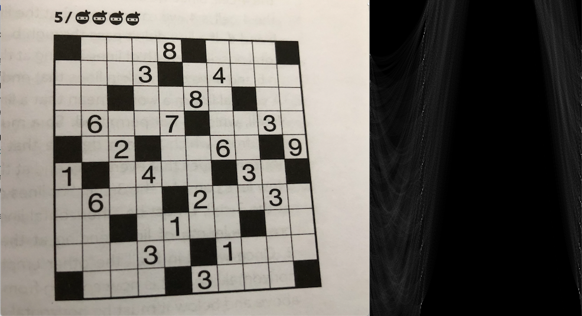
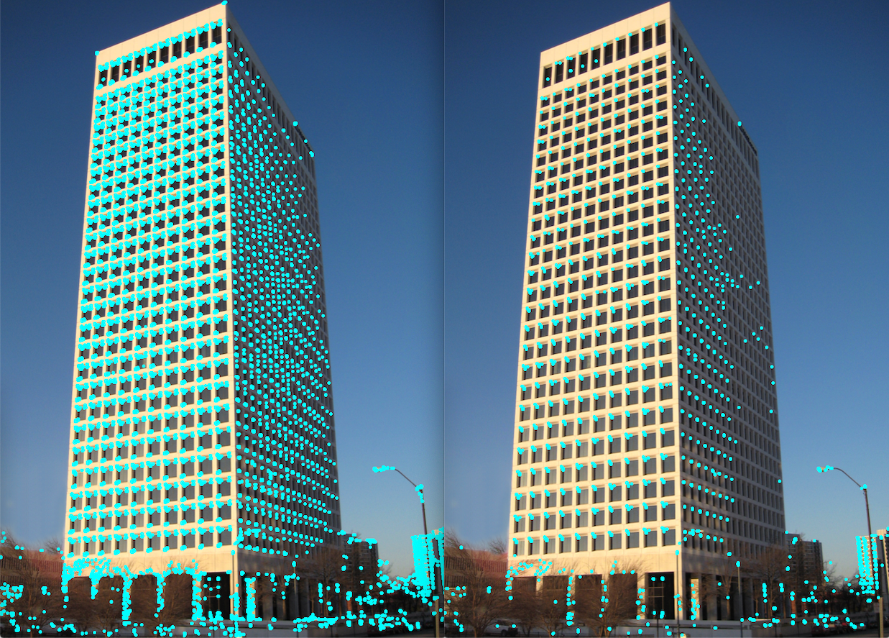

Feture extraction algorithms
==========================

## Hough transform
The Hough transform is mainly used in line detection. At least in this library. This function enables line detection
 but is of course free to use for other purposes. Note that this is not a generalized Hough transform, which means
  that the purpose is line detection.
  
[Hough transform, Wikipedia.](https://en.wikipedia.org/wiki/Hough_transform)

```cpp
Img feature::HoughTransform(const Img& im);
```
Returs the Hough transform as a new image. The image can now be used to search for local maximums (lines).

## Usage
```cpp
#include "algo.hpp"

using namespace algo::image;

...

// im is a gray-scale image
Img imh{feature::HoughTransform(im)};
```

### Examples




## Corner detection

### Eigenvalue based detectors, Harris and Shi-Tomasi
A traditional corner detector uses some way to measure how much a pixel is a corner. This library offers the Harris- and
 Shi-Tomasi- cornerness calculations.
 
[Corner detectors, WIkipedia.](https://en.wikipedia.org/wiki/Corner_detection)
 
[Lecture notes, Saad J Bedros, University of Minnesota.](https://bit.ly/2XzCuis)
 
```cpp
Points feature::Corners(const Img& im, const int& threshold, const CornerDetType& det_type = CornerDetType::kHarris,
                       const int& n_best = 0, const int& min_dist = 0,
                       const GaussWindowSettings& g_win_set = {Size{7, 7}, 1.0});
```
Returns a list of coordinates of corners in the input image `im`. By default, the `CornerDetType:kHarris
` (`CornerDetType::kShiTomasi`) is
 selected
. The user chan select to get the `n_best`, the n corners with the highest measure of corner. It's also possible to
 select the minimum distance between two pair of points, `min_dist`. To vary the quality of found corners, it's
  recommended to tweak the Gaussian kernel window size and standard deviation in `g_win_set`. Note that the window
   dimensions must be odd integers.
   
 The computation speed is dependent on the image size and the other input parameters.
   
 #### Usage
 ```cpp
#include "algo.hpp"

using namespace algo:image;

... 

Points points{feature::Corners(im, 9e2, feature::CornerDetType::kShiTomasi, 0, 4, {5, 5, 1.0})};
 ```

#### Examples

 

 

### FAST Corner detector
> Features from accelerated segment test (FAST) is a corner detection method, which could be used to extract feature points and later used to track and map objects in many computer vision tasks.
> [...] The most promising advantage of the FAST corner detector is its computational efficiency.

To find a corner with this algoritm, every candidate pixel is compared with the 16 surrounding pixels forming
the [Bresenham](https://en.wikipedia.org/wiki/Midpoint_circle_algorithm) circle. If 11 continuous pixels in 
the circle are either darker or brighter than the candidate pixel (+- some threshold) then the conditions are met.

```c++
Points FASTCorners(const Img& im, const int& intensity_threshold, const int& corner_threshold = 11);
```
Returns the FAST corners found in the input image `ìm`. The `intensity_threshold` is used to control how much
the candidate pixel must be darker or brighter than the Bresenham pixels. `corner_threshold` defines how many continuous 
pixels must be darker or brighter than the cnadidate pixel, the default is 11, it's not recommended to go below 8.

#### Usage
```c++
#include "algo.hpp"

...

Points points{algo::image::feature::FASTCorners(im, 20, 11)};
```

### Examples

`corner_threshold` 8 vs 11 

