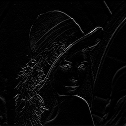

Image filter algorithms
==============

## Image convolutions

### Kernels

All kernels are 3x3 in size.

| Kernel type | Description | Example, gray-scale | Example, color |
|---|---|:---:|:---:|
|`SOBEL_X             ` | Horizontal edge detection.                          |           |            |
|`SOBEL_Y             ` | Vertical edge detection.                            |           |            |
|`EDGE_DETECT         ` | Edge detection all-directions                       |       |        |
|`SMOOTHING           ` | Simple image smoothing.                             |         |          |
|`SHARPEN_MODEST      ` | Simple image sharpen.                               |      |       |
|`SHARPEN_AGGRESSIVE  ` | Sharpens image.                                     |  |   |
|`GAUSSIAN_BLUR       ` | Approximated. See `GaussianBlur` for better kernel. |     |      |
|`BLUR_HARD           ` | Image blur.                                         |         |          |
|`BLUR_SOFT           ` | Image blur.                                         |         |          |
|`HIGH_PASS           ` | High pass filter.                                   |        |         |
|`EMBOSS              ` | Enhances edges.                                     |           |            |
|`WEIGHTED_AVERAGE    ` | Filters with average.                               | |  |
|`DILATION_HORIZONTAL ` | "Smears" images horizontally.                       |       | |
|`DILATION_VERTICAL   ` | "Smears" image vertically.                          |       | |
|`DILATION            ` | "Smears" image in all directions.                   |      | |