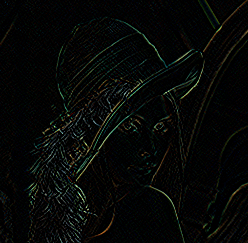

Image filter algorithms
==============

## Image convolutions

```cpp
Img Convolve(const Img& im, KernelType filter_type)
```
Applies a convolution on the input image `im` with the kernel defined by the input `kernel_type`.

### Usage
```cpp
#using namespace algo::image;

... 
// Get images with some function or lib, convert to Img.
...

Img im_smooth_g{filter::Convolve(im_gray, filter::KernelType::SMOOTHING)};
Img3 im_smooth_c{filter::Convolvo{im_color, filter::KernelType::SMOOTHING}};
```

### Kernels and examples

All kernels are 3x3 in size.

| Kernel type | Description | Example, gray-scale | Example, color |
|---|---|:---:|:---:|
|`SOBEL_X             ` | Horizontal edge detection.                          |           |            |
|`SOBEL_Y             ` | Vertical edge detection.                            |           |            |
|`EDGE_DETECT         ` | Edge detection all-directions                       |       |        |
|`SMOOTHING           ` | Simple image smoothing.                             |         |          |
|`SHARPEN_MODEST      ` | Simple image sharpen.                               |      |       |
|`SHARPEN_AGGRESSIVE  ` | Sharpens image.                                     |  |   |
|`GAUSSIAN_BLUR       ` | Approximated. See `GaussianBlur` for better kernel. |     |      |
|`BLUR_HARD           ` | Image blur.                                         |         |          |
|`BLUR_SOFT           ` | Image blur.                                         |         |          |
|`HIGH_PASS           ` | High pass filter.                                   |        |         |
|`EMBOSS              ` | Enhances edges.                                     |           |            |
|`WEIGHTED_AVERAGE    ` | Filters with average.                               | |  |
|`DILATION_HORIZONTAL ` | "Smears" image horizontally. *                      |       | |
|`DILATION_VERTICAL   ` | "Smears" image vertically. *                        |       | |
|`DILATION            ` | "Smears" image in all directions. *                 |      | |

(*) Takes an image convolved with `EDGE_DETECT` as input.

## Gaussian blur

```cpp
Img GaussianBlur(const Img& im, const Size& size, const float& sigma);
```
Will blur, also called smooth, the input image `im` by a Gaussian kernel defined by it's `size` and standard deviation `sigma`.
The larger size and standard deviation, the more smoothing will be added. It's also possible to run the function several times to apply more smoothing. 

[Gaussian blur, Wikipedia.](https://en.wikipedia.org/wiki/Gaussian_blur).

### Usage

```cpp
using namespace algo::image;

...

Img img1{GaussianBlur(im, Size{5, 5}, 1.0)};
// To get more smooting, use larger kernel size or/and standard deviation or run multiple times:
img1 = GaussianBlur(img1, Size{5, 5, 1.0});
img1 = GaussianBlur(img1, Size{5, 5, 1.0});
```

### Exampels

| Kernel size w x h | Standard deviation, sigma | Output |
|:---:|:---:|:---:|
| 5, 5      | 1.0 |      |
| 5, 5      | 1.5 |      |
| 11, 11    | 1.0 |    |
| 11, 11    | 1.5 |    |

## Median filter
```cpp
Img MedianFilter(const Img& im, const int& w_width, const int& w_height);

Img3 MedianFilter3(const Img3& im, const int& w_width, const int& w_height);
```
Should mainly be used to remove noise in the input image `im`. The window size defined by `w_width` and `w_height` will determine 
how large neighborhood the median will be based on. `MedianFilter` is for gray-scale images and `MedianFilter3` is for color images.

### Usage
```cpp
using namespace algo::image;

...

Img res{MedianFilter(im, 3, 3)};
```

### Examples

   

## Binary thresholding
```cpp
Img Fixed(const Img& im, const uint8_t& threshold, const bool& cut_white);
```
Returns an image that has been thresholded at a fixed threshold value `threshold`. If `cut_white == true` the thresholding will 
set the values greater than the fixed threshold to white. If `cut_white == false` the pixel values are set to black instead.

### Usage
```cpp
using namespace algo::image;

...

Img im_thr{threshold::Fixed(im, 120, true)};
```

### Example

Order: Input, cut_white = true, cut_white = false


## Adaptive thresholding
```cpp
Img Adaptive(const Img& im, const int& region_size, const bool& cut_white);
```
Instead of thresholding all pixes at the same fixed values, there's an option to threshold at a value fixed at the average
intensity value inside a sub-set of pixels, a rectangle with height = width = `region_size`.

### Usage
```cpp
using namespace algo::image;

...

Img im_thr{threshold::Adaptive(im, 12, true)};
```

### Example


