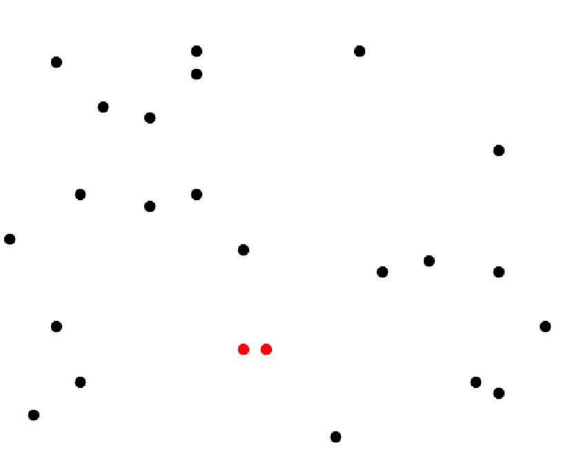
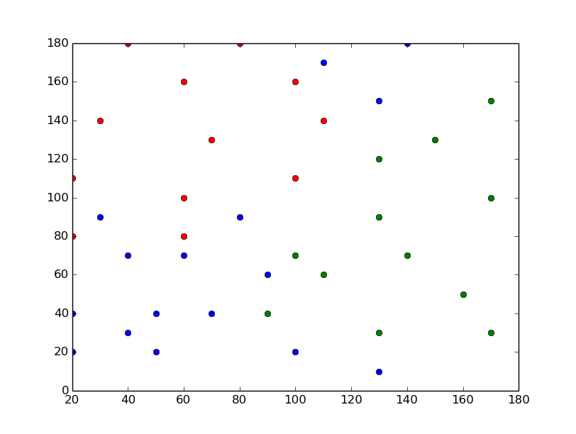
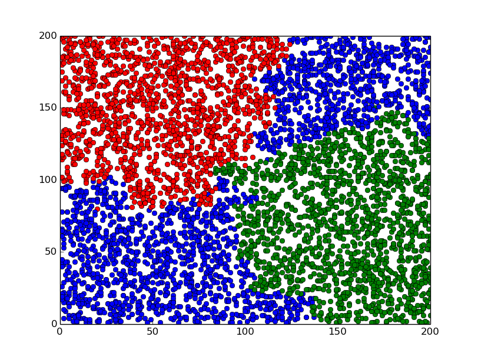
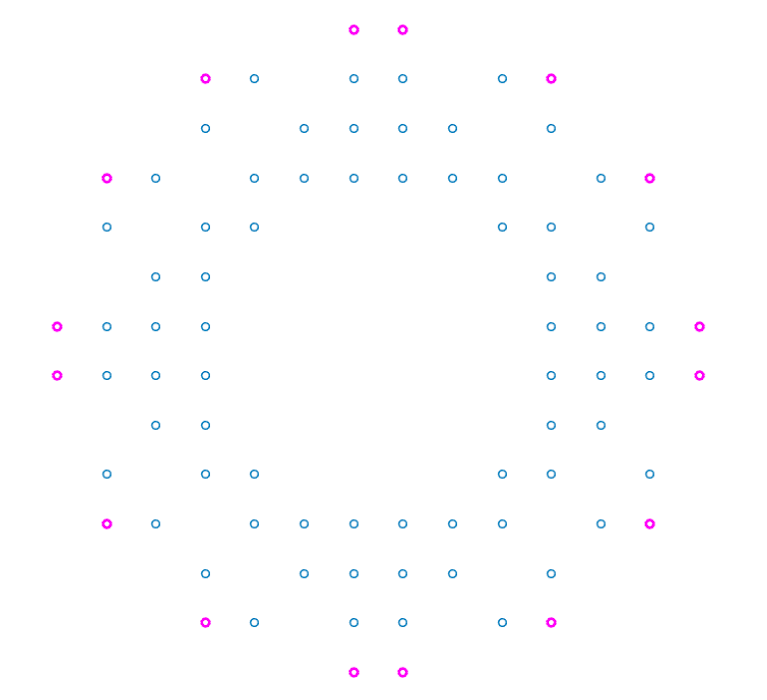
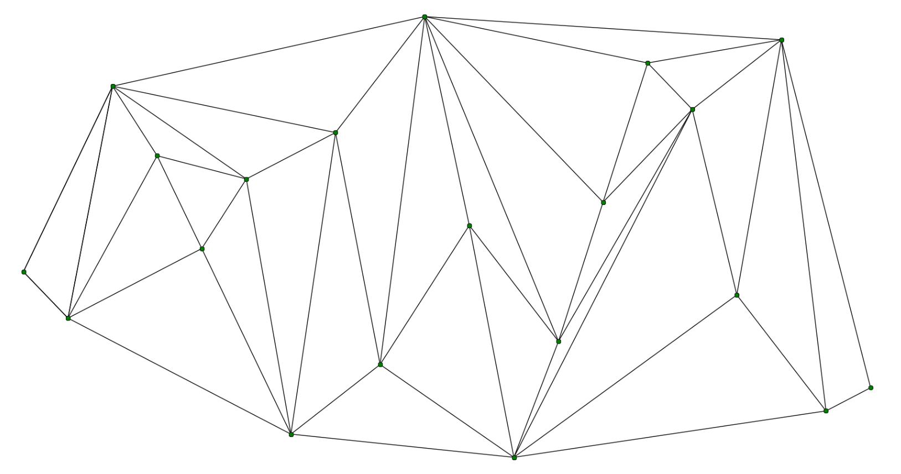

Computational Geometry
===================================

`geometry2d.cc` contains the basic stuff. 

### Closest Pair of Points
Finds the closest pair of points of some input set of points.

### K-Nearest Neighbors, knn or KNN
This implementation is a knn classification algorithm (i hope), the output is a class membership. (Wikipedia) An object is classified by a majority vote of its neighbors.
A classic example is a set of people who have told us on what political party they voted on, and where they live. Then a new person shows up, we know where this guy lives and wants to know on what party he or she likely would vote on. 
My test is based on a toy-example of this example. I have four regions, where the majority of the neighbors give their votes on either the blue, red or green party. For 5000 new people the example output looks like the image below, based on the training set in the first image. I asked three neighbors (3-NN).

### Quickhull Algorithm
Finds the set of points that constructs the convex hull of some input data set of points.
Reults of big input data sets may conveniently be plotted in matlab, or python or any other tool that is good at plotting.

The magenta points constructs the convex hull polygon of an example input. 

### Triangulation
This algorithm finds a triangulation of some input set of points.
See the example below.

