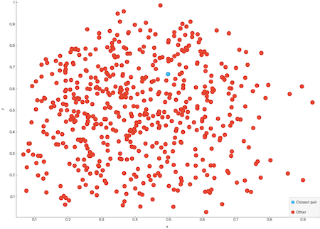

Computational geometry
===================================

## Closest pair of points
Finds the closest pair of points of some input set of points.

[Closest pair of points problem, Wikipedia](https://en.wikipedia.org/wiki/Closest_pair_of_points_problem)

### Usage
```C++
#include <geometry_algorithms.hpp>

using namespace algo::geometry;

...

  Points points{{0.162745, 0.676737},
                {0.578652, 0.674331},
                {0.201865, 0.252038},
                {0.609536, 0.232788},
                {0.351138, 0.478224},
                {0.365551, 0.491458}};

  Points closest{ClosestPairOfPoints(points)};
```

### Example
In the images below, the result from running th example `examples/geometry/closest_pair.cpp` is shown. It's 
hard to see that the closest pair of points is actually separated. After zooming in, it's possible to see that there are 
two blue points.




## Quickhull Algorithm
Finds the set of points that constructs the convex hull of some input data set of points.

[Quickhull, Wikipedia](https://en.wikipedia.org/wiki/Quickhull)

[Convex hull, Wikipedia](https://en.wikipedia.org/wiki/Convex_hull)

### Usage
```C++
#include <geometry_algorithms.hpp>

using namespace algo::geometry;

...

Points points{{0.15348, 0.355506},
            {0.2904, 0.354303},
            {0.156568, 0.220757},
            {0.292459, 0.224367},
            {0.223484, 0.291741}};

Points qh{ConvexHull(points)};
```

### Example
The example in `examples/geometry/qhull_example.cpp` outputs the following data shown in the image below. 
Note that the example does not plot it.


## Triangulation
This algorithm finds a triangulation of some input set of points.
See the example below.
