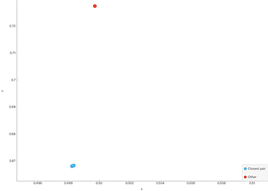

Computational geometry
===================================

### Closest pair of points
Finds the closest pair of points of some input set of points.

[Closest pair of points problem, Wikipedia](https://en.wikipedia.org/wiki/Closest_pair_of_points_problem)

#### Usage

The `ClosestPairOfPoints` takes a set of `algo::geometry::Points` and returns an other set of `Points` containing the closest pair of points.
 
##### Example usage
```C++
#include <geometry_algorithms.hpp>

using namespace algo::geometry;

...

Points points{{0.162745, 0.676737},
            {0.578652, 0.674331},
            {0.201865, 0.252038},
            {0.609536, 0.232788},
            {0.351138, 0.478224},
            {0.365551, 0.491458}};

Points closest{ClosestPairOfPoints(points)};
```

`examples/geometry/closest_pair.cpp`

 


### Quickhull Algorithm
Finds the set of points that constructs the convex hull of some input data set of points.

[Quickhull, Wikipedia](https://en.wikipedia.org/wiki/Quickhull)

[Convex hull, Wikipedia](https://en.wikipedia.org/wiki/Convex_hull)

#### Usage

The function `algo::geometry::ConvexHull` takes a set of `algo::geometry::Points` and returns a subset containing the 
convex hull of the input.

##### Example usage
```C++
#include <geometry_algorithms.hpp>

using namespace algo::geometry;

...

Points points{{0.15348, 0.355506},
            {0.2904, 0.354303},
            {0.156568, 0.220757},
            {0.292459, 0.224367},
            {0.223484, 0.291741}};

Points qh{ConvexHull(points)};
```

`examples/geometry/qhull_example.cpp`


### Triangulation of points
This algorithm finds a triangulation of some input set of points.
See the example below.

#### Usage

The function `algo::geometry::Triangulate` takes a set of `algo::geometry::Points` and computes the triangulation of them. 
`Triangulate` returns a set of `Lines{{Point, Point},...}`. Each item indicates the connection between two points in
the triangulation.

##### Example usage

```C++
#include <geometry_algorithms.hpp>

using namespace algo::geometry;

...

Points points{{0.112301, 0.440927},
            {0.339814, .723659},
            {0.614683, .516723},
            {0.414966, .294147}};

Lines lines{Triangulate(points)};
```

`examples/geometry/triangulate_example.cpp`

 