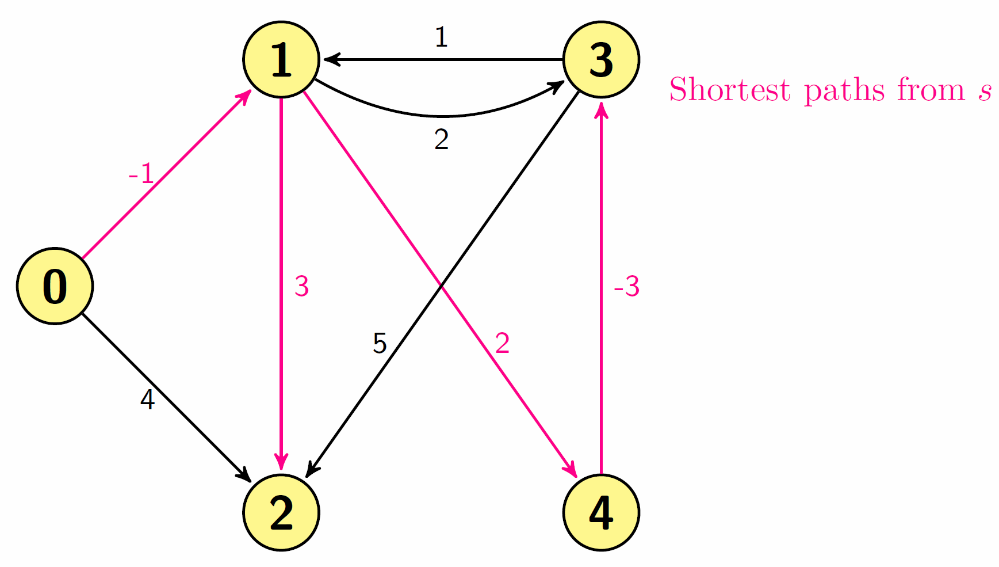
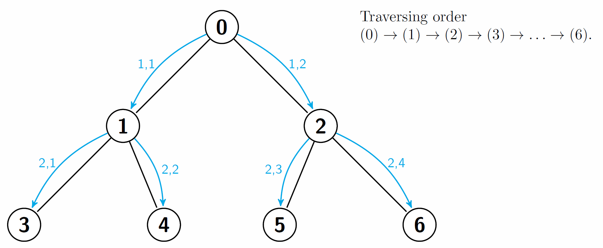
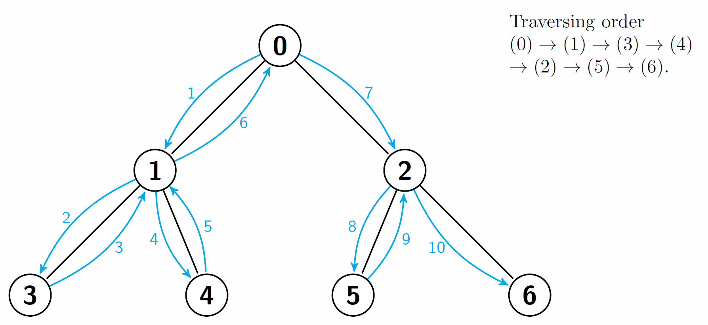
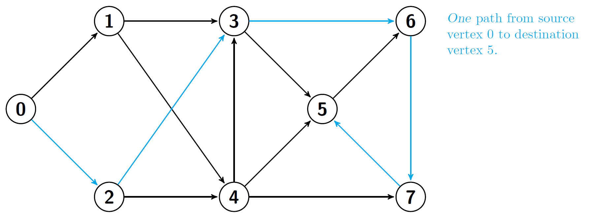
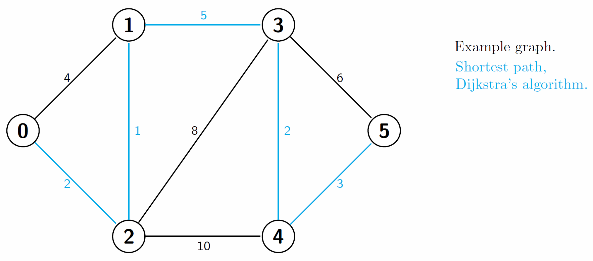

Graph Algorithms
=================================

### Bellman-Ford
Computes the shortest from a source vertex s to all the other vertices in a weighted directed graph. It does the same job as Dijkstra's algorithm, but it can handle negative edge weights. Thus it's more versatile. 

[Bellman-Ford, Wikipedia](https://en.wikipedia.org/wiki/Bellman%E2%80%93Ford_algorithm)

### Breadth First Seach (BFS)
BFS is an algorithm for graph/tree traversing/searching. The traversing starts at a given node and explores the neighbors before moving to the next level. See the example below.

[BFS, Wikipedia](https://en.wikipedia.org/wiki/Breadth-first_search)

### Depth-First Search (DFS)
DFS is an algorithm for traversing/searching trees and graphs. The algorithm starts at a given node and explores as "deep" as possible along each branch before backtracking.

[DFS, Wikipedia](https://en.wikipedia.org/wiki/Depth-first_search)

#### DFS, path-search
A variant of the ordinary DFS algorithm. This version finds a path from the source vertex s and the destination vertex t, although not necessarily the shortest. 

#### Dijkstra's Algorithm
`dijkstra.cc` and `dijkstra_pq.cc` find the shortest path between a give source s node and every other node in the graph s belongs to. The Latter is implemented with a priority queue.

