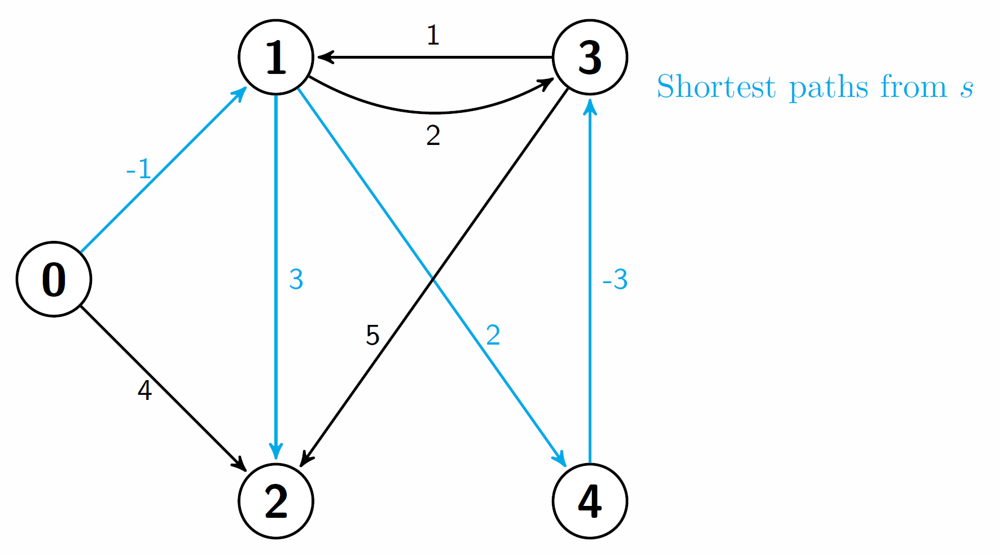

Graph Algorithms
=================================

#### Bellman-Ford
Computes the shortest from a source vertex s to all the other vertices in a weighted directed graph. It does the same job as Dijkstra's algorithm, but it can handle negative edge weights. Thus it's more versatile. 

