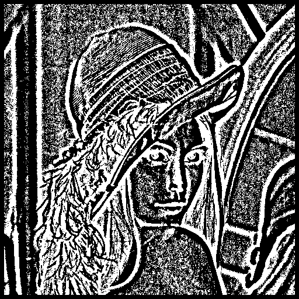
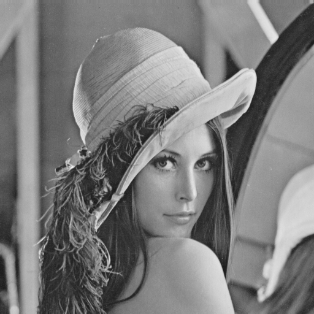
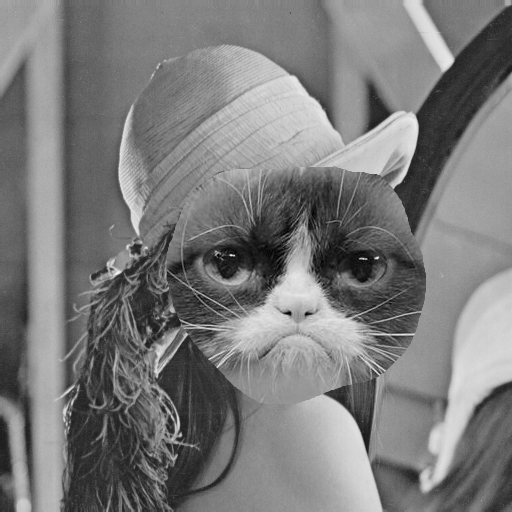
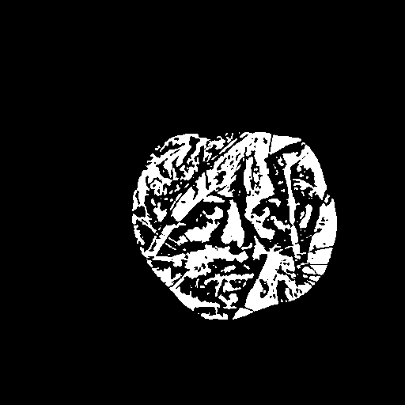
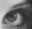
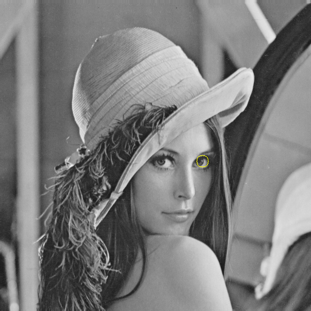

Image Processing algorithms
===================================================================
The aim for implementing this library is to implement functions for image processing from scratch.

[TOC]

### Algorithms
The following functions are implemented so far:

* Convolution
* Adaptive threholding
* Median filter
* Difference detector
* Template matching

### Convolution
Available filters (kernels):

* Sobel (x and y direction)
* Edge detection
* smoothing
* Sharpening
* Gaussian blur
* Embossing
* Weighted average
* Dilation (Requires binary images)

#### Test images

##### SOBEL-X, SOBEL-Y and EDGE_DETECT

##### SMOOTHING, SHARPEN_MODEST and SHARPEN_AGGRESSIVE

##### GAUSSIAN_BLUR, BLUR_HARD and BLUR_SOFT

##### HIGH_PASS, EMBOSS and WEIGHTED_AVERAGE

### Adaptive threshold
Outputs a thresholded image using an adaptive approach. Instead of using a fixed value to threshold on,
the pixels are thresholded on a mean value around the pixel.

### Median filter
This algorithm is using a median filter to remove noise in an image.
Compare in the example below before and after the median filter.

### Difference detector
Detects the difference of an input reference image and a second image.
The image should have the same background. In the example below, I have used Lena
and Grumpy Lena as reference and comparison image respectively. In the third image
the result is shown.

#### LENA, GRUMPY_LENA and RESULT

### Template matching
Finds a point where the intesity values meet in the reference image and the template image.

