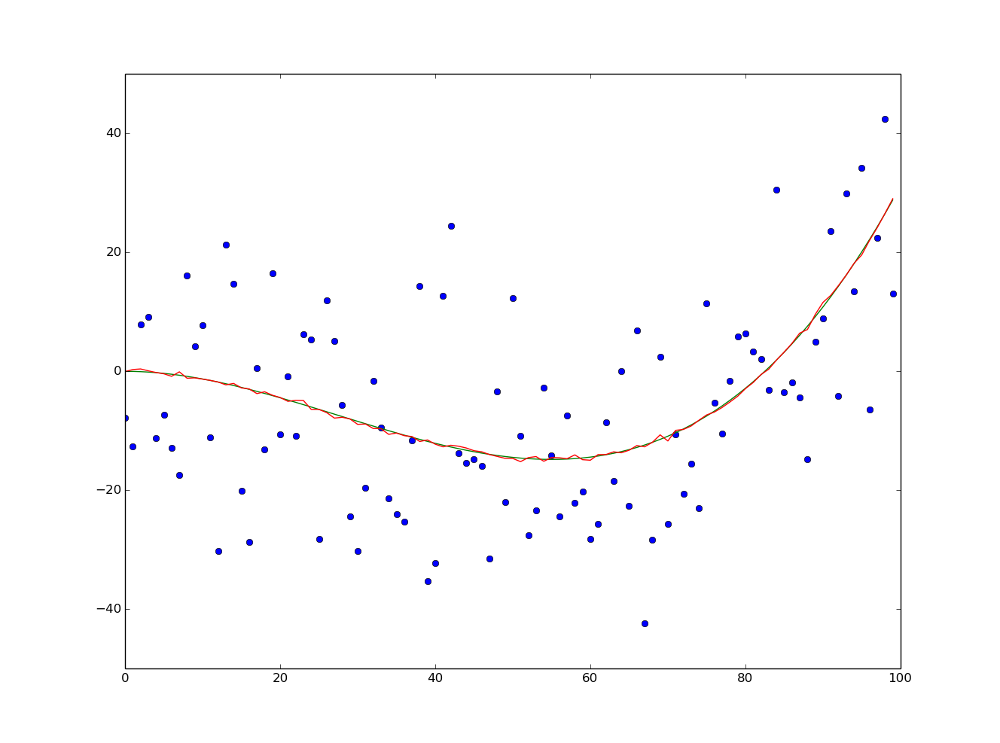

Machine Learning Algorithms
===================================

### Bootstrap Aggregating, Bagging
Designed to improve the stability and accuracy. Simple as; sample from a training set k times, this sample may or may not have happend but we use it as anyway. If one sample many times one get very nice data, the mean of the samples is almost unbiased.
In the example below, the green curve is the "real data", which is barely visible behind the bootstrapped data. The bagging data was sampled 1000 times.

### K-Nearest Neighbors, knn or KNN
This implementation is a knn classification algorithm (i hope), the output is a class membership. (Wikipedia) An object is classified by a majority vote of its neighbors.
A classic example is a set of people who have told us on what political party they voted on, and where they live. Then a new person shows up, we know where this guy lives and wants to know on what party he or she likely would vote on. 
My test is based on a toy-example of this example. I have four regions, where the majority of the neighbors give their votes on either the blue, red or green party. For 5000 new people the example output looks like the image below, based on the training set in the first image. I asked three neighbors (3-NN).

### K-means Clustering
Takes a set of data points, selectes k points randomly, they are the centroids, the rest of the points will be put in a cluster, where the distance to centroid i is the shortest. Then the cntroid is moved to the center of the cluster and the process iterates a few times until convergence.

Below are some examples of different choices on k, the amount of data points varies between 50 000 and 1 000 000.

