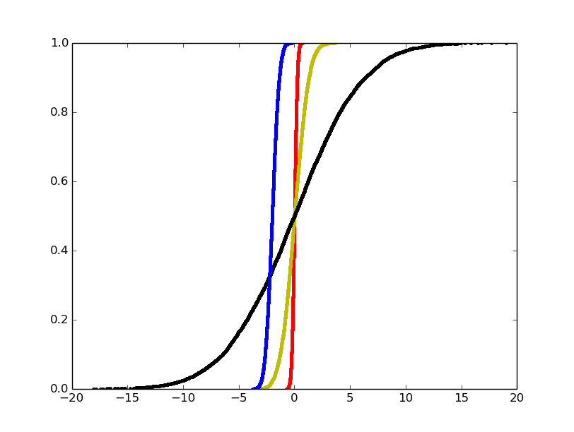
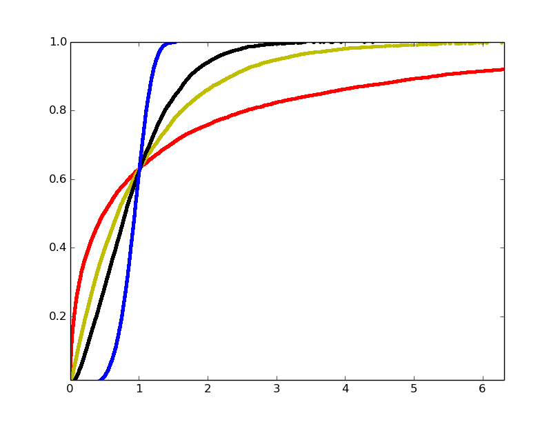
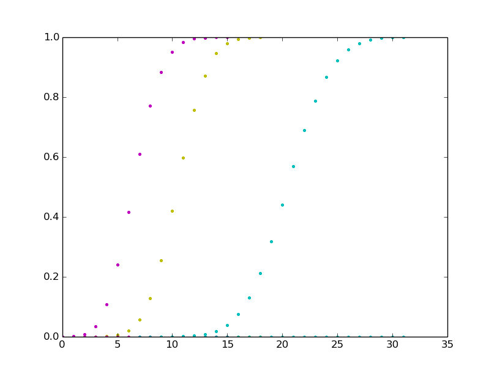

Math Algorithms
============================

### Eratosthenes Algorithm for Prime Numbers
The title says it all. It is fast.

[Sieve of Eratosthenes, Wikipedia](https://en.wikipedia.org/wiki/Sieve_of_Eratosthenes)

### Euclidean Algorithm
Is used for finding the greatest common divisor (gcd) of two integers a and b.

[Euclidean Algorithm, Wikipedia](https://sv.wikipedia.org/wiki/Euklides_algoritm)

###The Fast Fourier Transform (FFT) and the inverse FFT
An algorithm that computes the Discrete Fourier Transform (DFT) of a sequence. Fourier analysis converts a signal from its original domain (time or space) to the frequency domain.
Not really sure how to test the implementation, the applications for FFT can be filtering, image compression, fast large integer and polynomial multiplication. There is a tiny test, just to verify that the algorithm works. 

### Karatsuba Algorithm
A slightly faster multiplication algorithm than old-school O(n²)

[Karatsuba Algorithm, Wikipedia](https://en.wikipedia.org/wiki/Karatsuba_algorithm)

### Matrix Multiplication 
The ordinary O(n^3) matrix multiplication algorithm. If the dimensions aren't humongous, this implementation should suffice.

### Random Numbers
The code generates (pseudo) random numbers according to some distribution.
So far, the distributions supported are the following:
* Uniform (c)
* Exponential (c) 
* Normal (c) (1st test below)
* Weibull (c) (2nd test below)
* Binomial (d) (3rd test below)
* Gamma (c)
* Poisson (d)
* Erlang  (c)
* Geometric (d)

