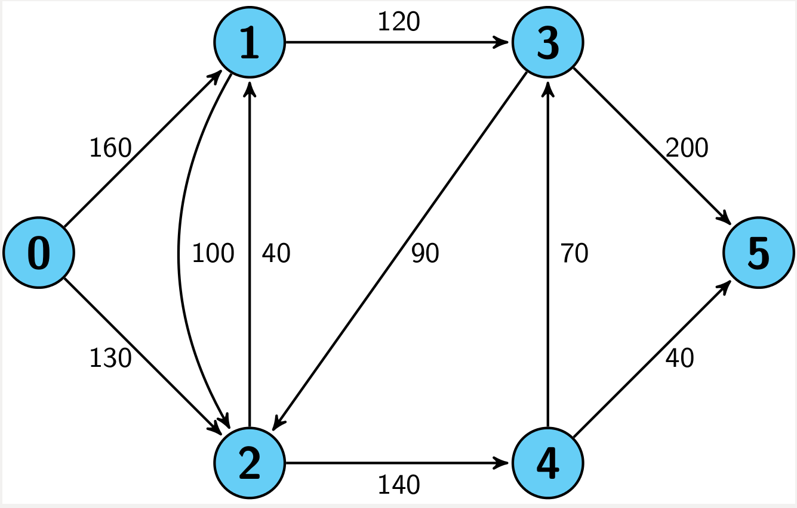
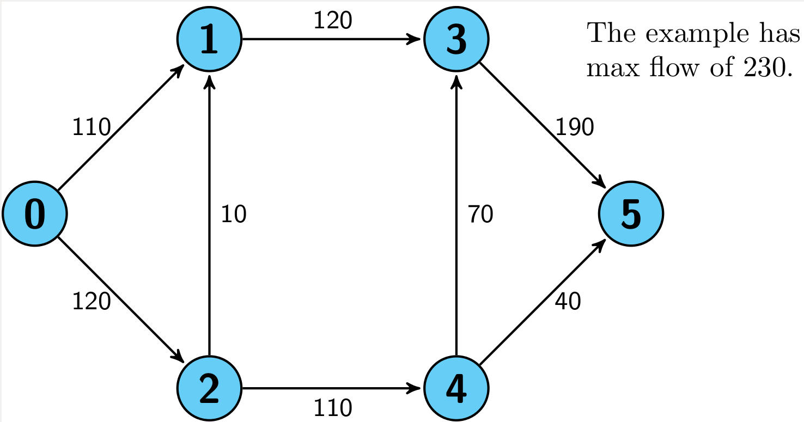

Network Algorithms
============================

#### Ford-Fulkerson Algorithm
This algorithm computes the maximum flow from the source vertex s to the sink vertex t. 

[Ford-Fulkersson, Wikipedia](https://en.wikipedia.org/wiki/Ford%E2%80%93Fulkerson_algorithm)

### PageRank Algorithm
An algorithm used by Google to rank results in their search engine. This is not the only algorithm that is used but the first. The rank value indicates an importance of a web page. 
PageRank has also been used by Twitter to rank tweet that may interest the reader. 

The PageRank algorithm outputs a probability distribution that represents the probability that a "random" user will click on a link and arrive at any particular page. 

A representation of "links" may be represented like in the picture below. "Take it with a grain of salt".

[PageRank, Wikipedia](https://en.wikipedia.org/wiki/PageRank)

