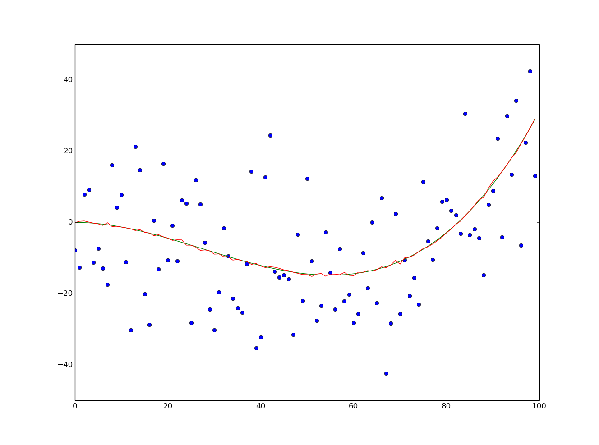
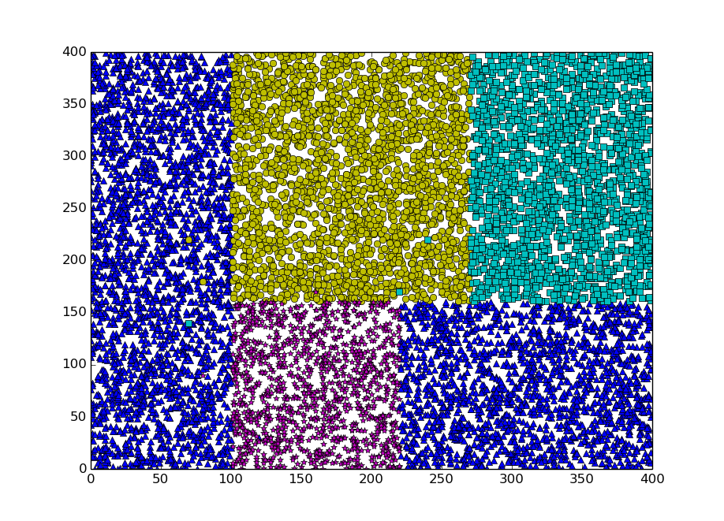

Machine Learning Algorithms
===================================

### Bootstrap Aggregating, Bagging
Designed to improve the stability and accuracy. Simple as; sample from a training set k times, this sample may or may not have happend but we use it anyway. If one sample many times one get very nice data, the mean of the samples is almost unbiased.
In the example below, the green curve is the "real data", which is barely visible behind the bootstrapped data. The bagging data was sampled 1000 times, the blue data is one set of the training data, wich consisted of several sets.

### Decision Tree Learning
Maps observations about an item to conclusions abot the item's target value. When a new item is added a majority vote is done to give the new item a label.

It was hard to find data to use, or too complicated to use. So I invented my own tree structure which uses hashmaps with strings as keys.

The example below got squares, circles, stars and triangles as labels.

