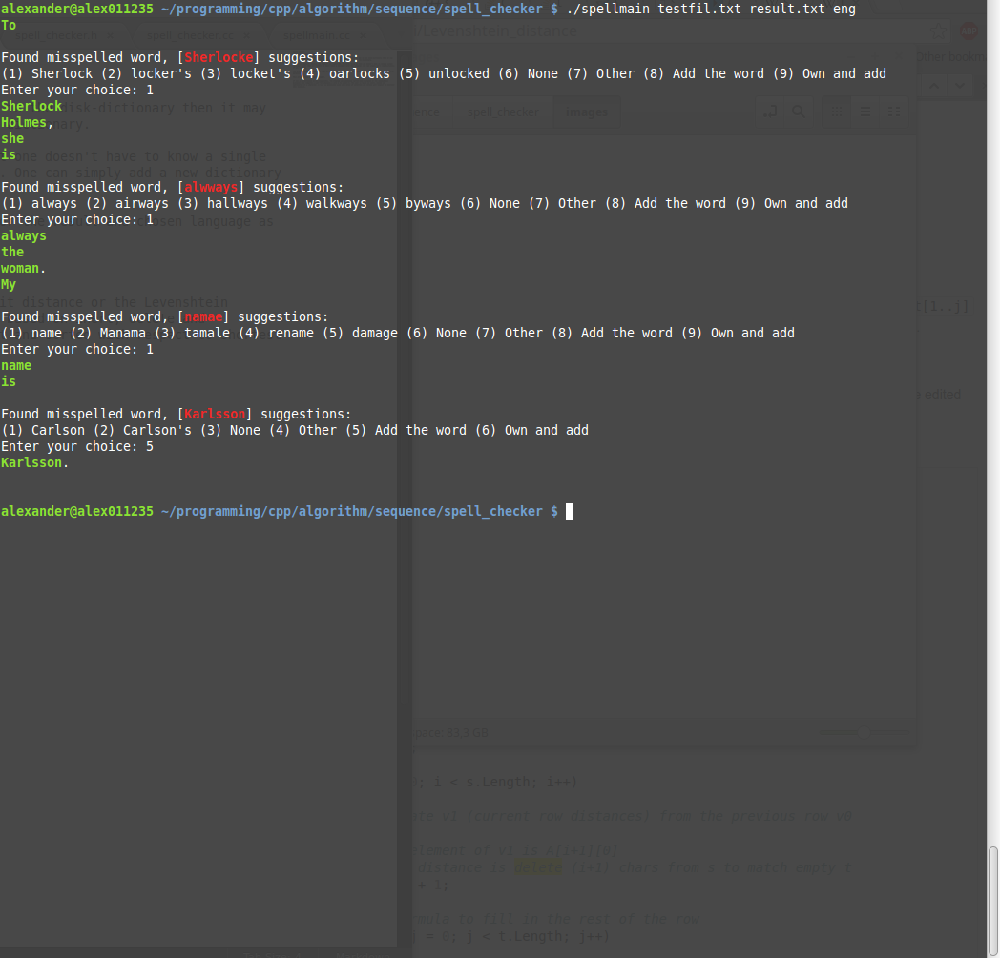

Spell Checker 
=============================

A spell check program. It uses dictionaries stored on disk, if a word is not in the disk-dictionary then it may be misspelled, otherwise the user has the opportunity to add the word to the dictionary. 

Currently, English, Spanish and Swedish are supported. The good thing is that one doesn't have to know a single language (other than C++ (here)) to spell check a document with this program. One can simply add a new dictionary of any language. 

The program takes an input file that is to be spell checked, a output file for the result and chosen language as parameters. 

This program does NOT check grammar. 

If one is interested in the algorithms, the program use something called edit distance or the Levenshtein distance that computes a cost for changing a word A to a word B. The cost is based on inert, delete and substitution of a character. A list is maintained with some words of interest and sorted with respect to shortest edit distance. 

 
 

 
